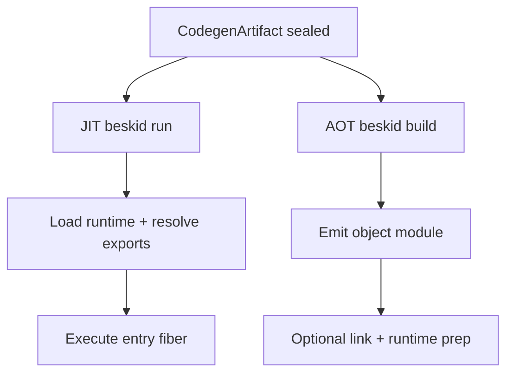

## Backend split

- **JIT path** (`beskid run`): compile artifact in-process and execute resolved entrypoint.
- **AOT path** (`beskid build`): emit object, optionally prepare runtime, optionally link native output.

Both paths **must** consume the same lowering artifact contract. JIT and AOT **must not** rebuild [`ProgramAssembly`](/platform-spec/compiler/build-pipeline/program-assembly/) or re-resolve `CompilePlan`; assembly is owned by `beskid_analysis` front-end services only.
