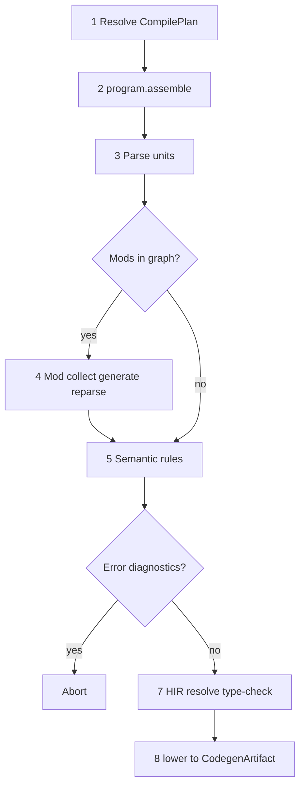

## End-to-end lowering spine

## Ordered steps

1. Resolve source path/text through services (manifest, workspace graph, `CompilePlan`, optional materialized workspace).
2. **Assemble program** — Build `ProgramAssembly` from effective roots (`program.assemble`); discover and parse compilation units per **[Program assembly](/platform-spec/compiler/build-pipeline/program-assembly/)**.
3. Parse entry (and indexed units) and produce syntax diagnostics.
4. **Mod host (when transitive `Mod` dependencies exist)** — Load AOT artifacts, discover contracts, run collect → generate → analyze → rewrite under **[Mod host bridge](/platform-spec/compiler/compiler-mods/mod-host-bridge/)** policy, merge typed AST contributions, and re-parse as required (bounded by `maxGeneratorRounds`). Skip when no mod dependencies apply.
5. Run builtin staged semantic rules when diagnostics are enabled (same diagnostic channel as mod diagnostics).
6. Abort on error diagnostics.
7. Transform to HIR, resolve symbols against **`ModuleIndex`**, and type-check the entry unit.
8. Lower typed program to backend artifact for JIT/AOT.

The canonical lowering entrypoint remains `beskid_codegen::services::lower_source` (and `_with_pipeline`); mod orchestration **must** live in `beskid_analysis` services (or a dedicated host module re-exported there) so CLI, LSP, and codegen share one scheduling spine.
