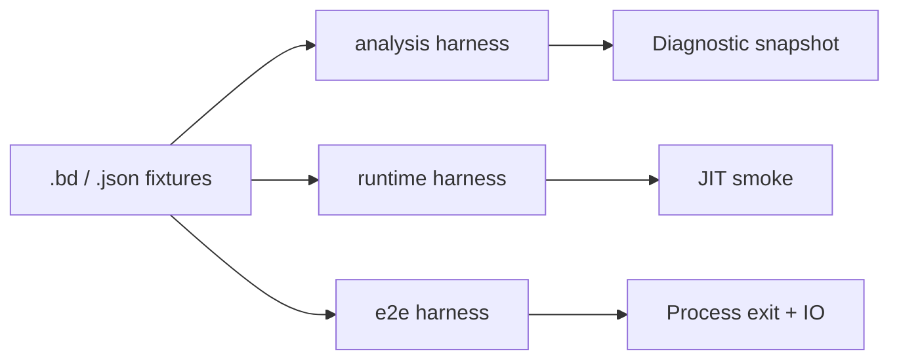

## Harness layers

Conformance is split so failures localize quickly:

| Layer | Crate path | Pins |
| --- | --- | --- |
| **Analysis fixtures** | `beskid_tests/src/analysis` | Diagnostic codes, resolver graphs, staged rules |
| **Runtime JIT** | `beskid_tests/src/runtime` | Builtin dispatch, GC, fibers |
| **E2E sources** | `beskid_e2e_tests` | Full `.bd` programs through CLI backends |
| **Doc tests** | `beskid_tests/src/doc_tests.rs` | Spec snippets compile and match asserted output |

## Fixture conventions

- Prefer **minimal** `.bd` files per diagnostic or rule; share `Project.proj` layouts via `beskid_tests/src/projects` builders.
- Golden diagnostics **must** cite stable codes from [diagnostic code registry](/platform-spec/compiler/semantic-pipeline/diagnostic-code-registry/).
- Runtime tests **must** negotiate the same ABI version as production `beskid run`.

## Code anchors

- `compiler/crates/beskid_tests/src/analysis`
- `compiler/crates/beskid_tests/src/runtime`
- `compiler/crates/beskid_e2e_tests/src/tests/runtime_cases.rs`
- `compiler/crates/beskid_tests/src/doc_tests.rs`
