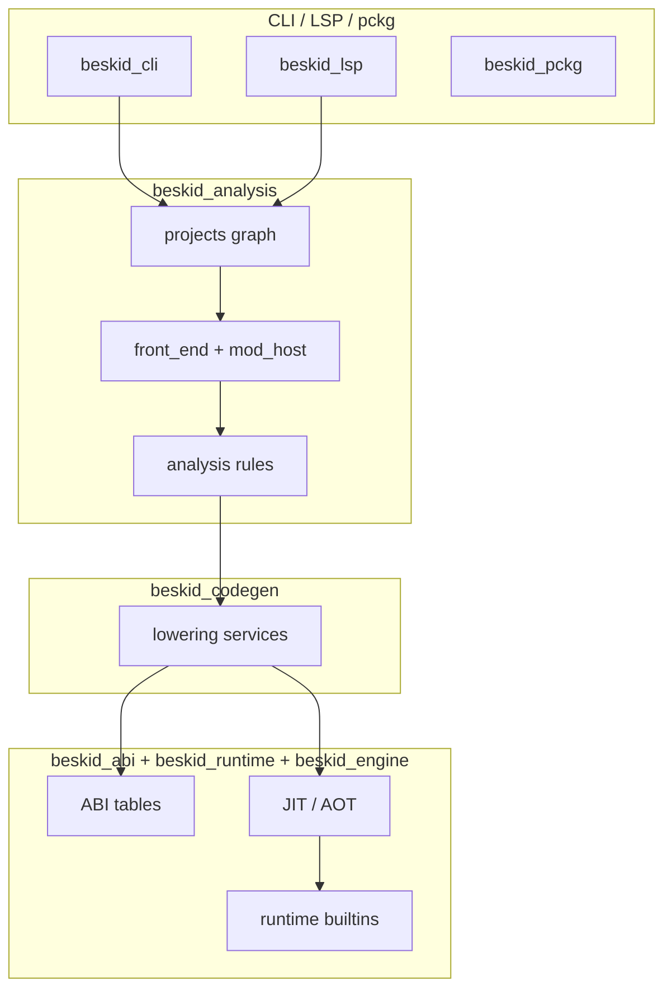

## Map role

This feature is the **maintenance index** between Rust crates and normative spec leaves. When you change behavior in a crate, update the linked spec article in the same change set; when you add a spec contract, anchor it to the owning crate here.

## Primary actors

| Actor | Responsibility |
| --- | --- |
| **Producer crates** | Emit diagnostics, artifacts, and ABI metadata (`beskid_analysis`, `beskid_codegen`) |
| **Consumer crates** | Execute or validate artifacts (`beskid_engine`, `beskid_runtime`, tooling) |
| **Tooling crates** | CLI binary, shared command framework, LSP, package client (`beskid_cli`, `beskid_tools`, `beskid_lsp`, `beskid_pckg`) |
| **Infrastructure crates** | Pipeline ordering, graph model, queries, codegen utilities (`beskid_pipeline`, `beskid_graph`, `beskid_queries`, `beskid_ast_derive`, `beskid_ast_reflect_gen`, `beskid_runtime_bridge`, `beskid_template`, `abfall`) |
| **Conformance crates** | Pin observable behavior (`beskid_tests`, `beskid_e2e_tests`) |

## Crate quick anchors

- `beskid_analysis` — parser, resolution, semantic pipeline, mod host
- `beskid_codegen` — lowering contract
- `beskid_abi` + `beskid_runtime` — execution ABI/runtime leaves
- `beskid_engine` — JIT execution of CodegenArtifact
- `beskid_aot` — AOT compilation and object emission
- `beskid_pipeline` — stable pipeline phase ordering
- `beskid_graph` — project graph model
- `beskid_queries` — Salsa incremental query engine
- `beskid_cli` — Clap command surface and thin dispatch
- `beskid_tools` — pipeline UI, diagnostics, `CommandSession`, corelib provision, registry helpers
- `beskid_lsp` — language server, diagnostics parity
- `beskid_pckg` — package registry client
- `beskid_runtime_bridge` — arch/OS interop bridge
- `beskid_template` — project scaffolding templates
- `abfall` — GC allocator (Sweep, Mark, Compact)
- `beskid_tests` + `beskid_e2e_tests` — conformance leaves
- `beskid_ast_derive`, `beskid_ast_reflect_gen` — internal codegen utilities

## Compiler mod anchors (reference compiler)

| Concern | Primary crates | Spec leaves |
| --- | --- | --- |
| Stable pipeline phase ids | `beskid_pipeline` | **[Stage ordering](/platform-spec/compiler/build-pipeline/stage-ordering/)** |
| Manifest + graph + `CompilePlan` | `beskid_analysis::projects` | **[Project manifest contract](/platform-spec/tooling/manifests-and-lockfiles/project-manifest-contract/)**, **[Workspace resolution contract](/platform-spec/compiler/resolution-and-projects/workspace-resolution-contract/)** |
| Program assembly + effective roots | `beskid_analysis::projects::assembly`, `beskid_analysis::services::front_end` | **[Program assembly](/platform-spec/compiler/build-pipeline/program-assembly/)** |
| Parse + SyntaxMirror | `beskid_analysis::syntax`, `beskid_analysis::parser` | **[Syntax domain model generation](/platform-spec/compiler/compiler-mods/syntax-domain-model-generation/)**, **[SyntaxMirror facade](/platform-spec/compiler/compiler-mods/beskid-compiler-syntax-facade/)** |
| Mod host orchestration | `beskid_analysis::mod_host` (`discovery`, `load`, `capabilities`, `collect`, `generate`, `merge`, `reparse`, `analyze`, `rewrite`) | **[Mod host bridge](/platform-spec/compiler/compiler-mods/mod-host-bridge/)**, **[Incremental scheduling and determinism](/platform-spec/compiler/compiler-mods/incremental-scheduling-determinism/)** |
| Mod host service integration | `beskid_analysis::services::analyze`, `beskid_codegen::services` | **[Stage ordering](/platform-spec/compiler/build-pipeline/stage-ordering/)**, **[Typed emitter and transforms](/platform-spec/compiler/compiler-mods/typed-emitter-and-transforms/)** |
| Mod diagnostics + facades | `beskid_analysis::analysis`, `beskid_analysis::query` | **[Analysis, query, and diagnostics facades](/platform-spec/compiler/compiler-mods/analysis-query-diagnostics-facade/)**, **[Diagnostic code registry](/platform-spec/compiler/semantic-pipeline/diagnostic-code-registry/)** |
| Analyzer/rewriter staging | `beskid_analysis::analysis::rules::staged` | **[Rules pipeline contract](/platform-spec/compiler/semantic-pipeline/rules-pipeline-contract/)** |
| Type checking (authoritative) | `beskid_analysis::services::lower` (`lower.type_check`) | **[Semantic pipeline / Stage ordering](/platform-spec/compiler/semantic-pipeline/stage-ordering/)**, **[Type-system pass contract](/platform-spec/compiler/semantic-pipeline/type-system-pass-contract/)** |
| Lowering after typed merge | `beskid_codegen::services` | **[Stage ordering](/platform-spec/compiler/build-pipeline/stage-ordering/)**, **[Typed emitter and transforms](/platform-spec/compiler/compiler-mods/typed-emitter-and-transforms/)** |
| LSP parity | `beskid_lsp` | **[Diagnostics and workspace analysis](/platform-spec/tooling/lsp/diagnostics-and-workspace-analysis/)** |
| Incremental tests | `beskid_tests` | **[Incremental scheduling and determinism](/platform-spec/compiler/compiler-mods/incremental-scheduling-determinism/)** |
| Pipeline composition (Rust) | `beskid_pipeline`, `beskid_analysis` | **[Pipeline composition](/platform-spec/compiler/pipeline-composition/)** |
| AOT compilation and linking | `beskid_aot` | **[Backends (JIT/AOT)](/platform-spec/compiler/build-pipeline/backends-jit-aot/)** |
| Project graph model | `beskid_graph` | **[Workspace resolution contract](/platform-spec/compiler/resolution-and-projects/workspace-resolution-contract/)**, **[Pipeline composition](/platform-spec/compiler/pipeline-composition/)** |
| Salsa incremental queries | `beskid_queries` | **[Analysis, query, and diagnostics facades](/platform-spec/compiler/compiler-mods/analysis-query-diagnostics-facade/)** |
| Runtime bridge (arch/OS interop) | `beskid_runtime_bridge` | **[Rust ABI profile](/platform-spec/language-meta/interop/rust-abi-profile/)**, **[C ABI profile](/platform-spec/language-meta/interop/c-abi-profile/)** |
| Template scaffold | `beskid_template` | **[Project templates](/platform-spec/tooling/project-scaffolding/project-templates/)**, **[beskid new](/platform-spec/tooling/project-scaffolding/beskid-new/)** |
| Garbage-collector allocator | `abfall` | **[Memory and GC runtime contract](/platform-spec/execution/runtime/memory-and-gc-runtime-contract/)** |
| AST derive macros (internal) | `beskid_ast_derive` | Internal codegen utility — no normative spec surface |
| AST reflection/visitor gen (internal) | `beskid_ast_reflect_gen` | Internal codegen utility — no normative spec surface |
