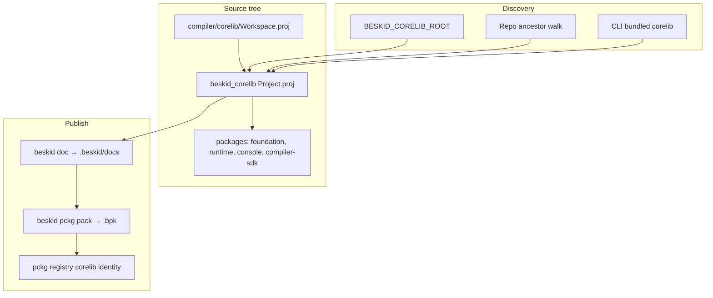

## Purpose

One canonical **corelib** package identity (`corelib`, sources under `compiler/corelib/beskid_corelib`) must be discoverable by CLI, LSP, CI publish, and local superrepo layouts. This feature covers **where** that tree lives on disk and **how** it is packed for pckg—not symbol injection (see **[Corelib injection and resolution](/platform-spec/core-library/compiler-integration/corelib-injection-and-resolution/)**).

## Discovery and packaging topology

## Primary actors

| Actor | Role |
| --- | --- |
| **Aggregate package** | `beskid_corelib` — declares dependencies on workspace member packages |
| **Workspace** | `compiler/corelib/Workspace.proj` lists shards including `corelib_console` |
| **Toolchain** | `resolver.rs` + `beskid_cli` `corelib_runtime` locate roots |
| **Registry** | CI publishes **`corelib`** via `beskid pckg` + `BESKID_PCKG_KEY` |

## Package readme

Published `.bpk` artifacts **should** expose registry documentation through root **`README.md`**. Producers declare the on-disk source in `Project.proj` or `Workspace.proj`:

- Optional `readme = "relative/path.md"` (POSIX-style path relative to the package or workspace root).
- When omitted, tooling uses **`readme.md`** at that root when the file exists.
- `beskid pckg pack` copies the resolved file into the artifact as **`README.md`** when it is not already a root readme entry.

## Workspace members

`compiler/corelib/Workspace.proj` includes **`packages/console`** (`corelib_console`) alongside `foundation`, `runtime`, and `compiler-sdk`. The aggregate `beskid_corelib` project depends on `corelib_console` for console/ANSI surfaces.

## Implementation anchors

- Canonical package root: `compiler/corelib/beskid_corelib`
- Console package: `compiler/corelib/packages/console`
- Discovery: `compiler/crates/beskid_analysis/src/projects/graph/resolver.rs`
- CLI embedding: `compiler/crates/beskid_cli/build.rs`, `corelib_runtime.rs`
- Tests: `compiler/crates/beskid_tests/src/projects/corelib`
- Server ingest: `pckg/src/Server/Services/PackagePublishDocumentation.cs`
