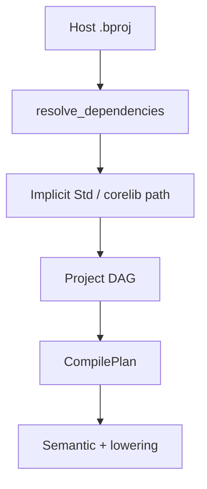

## Purpose

Host projects (`Host`, including template output) **always** receive an implicit dependency on the canonical **corelib** aggregate (`beskid_corelib`, package identity **`corelib`**, manifest **`corelib.bproj`**, `type = Aggregate`). Injection happens during DAG construction in `resolve_dependencies`, not via optional manifest flags. **Graph attachment is unchanged**; reachable symbols require manifest dependencies and explicit **`use`** imports—see **[Explicit use, no prelude](/platform-spec/tooling/manifests-and-lockfiles/adr/0006-explicit-use-no-prelude/)**.

## Injection model

| Input | Resolution |
| --- | --- |
| `BESKID_CORELIB_ROOT` | Points at workspace or install root containing `beskid_corelib/corelib.bproj` |
| Repo discovery | Walk ancestors for `compiler/corelib/beskid_corelib` |
| Explicit `Std` / `corelib` path dep | Honored when declared; path fallback uses `default_corelib_dependency_path()` |
| Corelib workspace shards | `compiler/corelib/packages/*` **must not** get implicit back-edge (cycle guard) |

The aggregate **`corelib`** node is **dependency-only** (`type = Aggregate`): it groups shard path dependencies and **must not** contribute a prelude or implicit module seed list to assembly.

## Manifest prohibitions

`beskid_analysis` `projects/parser.rs` rejects `noCorelib` and `useCorelib: false` at parse time. Templates and scaffolds **must not** emit opt-out keys.

## Symbol resolution

After the graph attaches corelib nodes, semantic resolution treats corelib types and builtins like any other dependency assembly: same `CompilationContext`, same diagnostic catalog. Modules become visible only through **`use`** paths declared against effective dependency roots—no automatic prelude union seeding. User-visible names defer to language-meta; this feature covers **graph attachment only**.

## CLI and LSP parity

`ensure_corelib_ready` in `beskid_cli` materializes bundled corelib before commands run. LSP uses the same resolver paths via `CompilationContext::try_for_analysis_path_with_graph_options`.

## Implementation anchors

- `compiler/crates/beskid_analysis/src/projects/graph/resolver.rs` — `default_corelib_dependency_path`, `is_corelib_workspace_shard_manifest`
- `compiler/crates/beskid_analysis/src/projects/parser.rs` — opt-out rejection
- `compiler/crates/beskid_cli/src/corelib_runtime.rs`, `build.rs`
- Tests: `compiler/crates/beskid_tests/src/projects/corelib/compile.rs`
