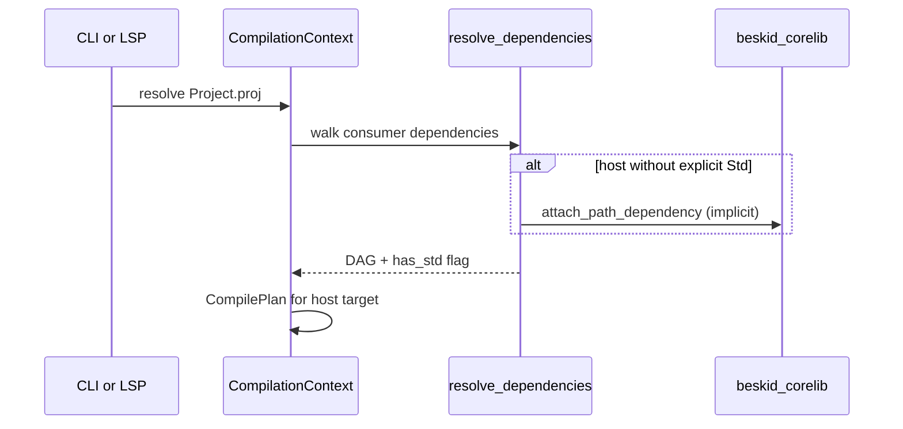

## Graph build sequence

1. Load consumer `ProjectManifest`.
2. For each declared dependency, attach path or registry materialization per **[Workspace and lock contracts](/platform-spec/tooling/manifests-and-lockfiles/workspace-and-lock-contracts/)**.
3. If consumer is a host project, not a corelib shard, and lacks `Std`, call `default_corelib_dependency_path()` and attach as path dependency.
4. Recurse into corelib aggregate and its workspace package shards (`foundation`, `runtime`, `console`, `compiler-sdk`).
5. Build `CompilePlan`; semantic pipeline resolves symbols across all assemblies.

## Environment and install paths

`BESKID_CORELIB_ROOT` may be the aggregate package directory or the parent workspace root (nested `beskid_corelib/Project.proj` detection in `corelib_aggregate_project_dir`).

## Failure modes

| Failure | Stage |
| --- | --- |
| Corelib root not found | Graph validation — manifest band diagnostics |
| Cycle via shard back-link | Prevented by `is_corelib_workspace_shard_manifest` guard |
| Opt-out manifest keys | Structural parse error before graph |

## Verification

`compiler/crates/beskid_tests/src/projects/corelib/compile.rs` and `mod.rs` assert compile success with implicit injection; layout tests ensure workspace shards do not create cycles.
