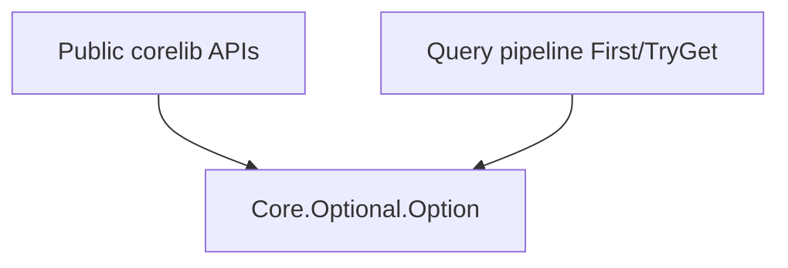

## Module layout

| Module | Role |
| --- | --- |
| `Core.Optional` | Hub re-exporting helpers |
| `Core.Optional.Option` | `pub enum Option<T> { Some, None }` |

## Helpers (v1)

| Function | Behavior |
| --- | --- |
| `HasValue<T>(Option<T>)` | `true` when variant is `Some` |
| `Map<T, U>(Option<T>, fn)` | Functor map; `None` propagates |
| `UnwrapOr<T>(Option<T>, T default)` | Returns `Some` value or `default` |

## Layering

## Migration

`Query.Contracts.Option` moved to `Core.Optional.Option` per [D-CORE-OPT-0003](./adr/0001-core-optional-canonical/). The deprecated `Query.Contracts` shim is removed; consumers (`Concurrency.Mutex`, `Concurrency.Channel`, `Core.Environment`, collections `Get`/`TryGet`, query `First`) **must** import `Core.Optional`.

## Implementation anchors

- `compiler/corelib/packages/foundation/src/Core/Optional/Option.bd`
- `compiler/corelib/packages/foundation/src/Core/Optional.bd`
