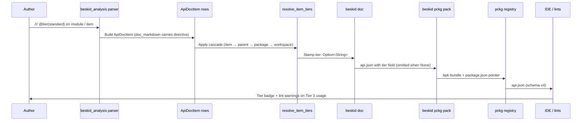

## End-to-end flow

## Numbered algorithm

1. **Author** writes a `///` doc comment containing `@tier(standard)`, `@tier(supported)`, or `@tier(unstable)` (aliases `Tier1` / `Tier2` / `Tier3` are also accepted, case-insensitive).
2. **Parser** (`beskid_analysis::doc`) captures the full markdown body in `ApiDocItem.doc_markdown`. Tier extraction is a separate pass; the parser does not interpret the directive.
3. **Tier resolver** (`beskid_analysis::doc::api_tier::resolve_item_tiers`) walks the cascade for every row:
    1. If the row's `doc_markdown` contains a `@tier(...)` directive, normalize and stamp.
    2. Otherwise look up the parent's resolved tier and inherit it.
    3. Otherwise leave the field as `None` so consumers apply the workspace default (`supported`).
4. **`beskid doc`** runs the resolver after `assign_declaring_packages` and after `link_graph`, so the cascade observes the final parent edges before serialization.
5. **Serializer** writes the result into `api.json` using camelCase (`"tier":"standard"`); the field is omitted entirely when `None`.
6. **`beskid pckg pack`** copies `api.json` into the `.bpk` and writes a pointer in `package.json` so the registry can index it without re-parsing the bundle.
7. **Consumers** (IDE, registry UI, lints) read the `tier` field directly; the absence of the field is treated as `supported`.

## Parser repair contract

Top-of-file `///` doc blocks must either attach to the first item or be folded into that item's prelude. Detached doc blocks before a blank line are a parse error because the grammar requires every `///` run to bind to the next declaration. The Path.bd repair landed in 2026-05-23 (`c1011b1` on the corelib branch) folds the module-level header into the `Separator` doc comment so the parser stays linear.

## Where to step through code

- Start with `compiler/crates/beskid_analysis/src/doc/api_tier.rs` (parser + cascade).
- Then inspect `compiler/crates/beskid_cli/src/commands/doc.rs` for the call site that runs the resolver before serialization.
- Validate the round-trip with `compiler/crates/beskid_tests/src/projects/corelib/layout.rs::checked_in_corelib_tier_metadata_round_trips_through_api_json`.
- Trace a real example through `compiler/corelib/packages/foundation/src/Collections/Array.bd` (Tier 1) and `Map.bd` (mixed Tier 2 / Tier 3 with `ContainsKey` marked unstable).
