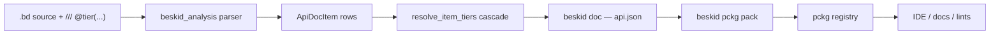

<SpecSection title="What this feature specifies" id="what-this-feature-specifies">
The corelib API-shape feature classifies every public corelib item into one of three stability tiers and pins the rules for how those tiers travel through the toolchain. It defines:

- The three tiers (**Standard** / **Supported** / **Unstable**), their semantic promises, and their default audience.
- How authors declare a tier on a module or item with a `@tier(...)` doc directive.
- How the compiler resolves tier metadata across the cascade (item-site → parent module → package default → workspace default) and writes the resulting value into `api.json`.
- The prelude rule that only Tier 1 modules may be re-exported through `beskid_corelib`'s prelude.
- The cross-version compatibility envelope each tier guarantees during a `v0.x` minor bump and during a `vN → vN+1` major.
</SpecSection>

<SpecSection title="Inputs and outputs" id="inputs-and-outputs">
| Stage | Input | Output |
| --- | --- | --- |
| Authoring | `///` doc comments containing `@tier(standard\|supported\|unstable)` on modules, types, functions, contract methods | Source carries normative tier declarations |
| Analysis (`beskid_analysis::doc::api_tier`) | `ApiDocItem` rows produced by `beskid doc` | Each row stamped with a resolved `tier: Option<String>` (omitted only when nothing resolves) |
| Packaging (`beskid pckg pack`) | `api.json` containing tier-tagged items | `.bpk` bundle whose `package.json` points at the tier-tagged `api.json` |
| Consumption (`beskid_pckg`, IDE) | `api.json` from the registry | Tier-aware UI badges, lint warnings on Tier 3 usage outside opt-in contexts |
</SpecSection>

<SpecSection title="State model" id="state-model">
The tier classification is deterministic and side-effect free. The resolver applies the following cascade, stopping at the first match:

1. `@tier(...)` directive on the item itself.
2. `@tier(...)` directive on the immediate parent module (inherited by all its members).
3. The package's default tier declared in `Project.proj` (when present).
4. The workspace default tier (currently `supported`).

Any item that flows through the cascade without resolving stays as `tier: None` in `api.json`; consumers treat that as the workspace default tier.
</SpecSection>

<SpecSection title="Algorithms and flow" id="algorithms-and-flow">
End-to-end pipeline:

See [Flow and algorithm](/platform-spec/core-library/stability-and-api-shape/corelib-api-shape/flow-and-algorithm/) for the numbered algorithm and the parser repair contract.
</SpecSection>

<SpecSection title="Edge cases and errors" id="edge-cases-and-errors">
- Method declared `@tier(standard)` on a Tier 3 type — see [Contracts and edge cases](/platform-spec/core-library/stability-and-api-shape/corelib-api-shape/contracts-and-edge-cases/).
- Conflicting directives on the same item — the closest directive wins; the resolver does not merge.
- Unknown tier value — rejected at analysis time with a clear diagnostic; the item stays `tier: None`.
- Prelude leakage — the prelude validator refuses to re-export Tier 2 or Tier 3 modules.
</SpecSection>

<SpecSection title="Compatibility and versioning" id="compatibility-and-versioning">
- **Tier 1 (Standard)** — signature stable across the entire `v0.x` line; breaking changes only at a major bump and only with a normative ADR.
- **Tier 2 (Supported)** — signature stable within a `v0.x` minor; behavior may evolve with deprecations.
- **Tier 3 (Unstable)** — signature may change without notice; consumers opt in by reading the tier field.
</SpecSection>

<SpecSection title="Security and performance notes" id="security-and-performance-notes">
Tier classification is metadata; it does not affect runtime semantics or codegen. The resolver runs in linear time over the `ApiDocItem` vector with no allocations beyond the resolved string. The `tier` field is omitted from `api.json` when `None`, keeping bundle size flat for legacy packages that have not yet annotated their surface.
</SpecSection>

<SpecSection title="Examples" id="examples">
See [Examples](/platform-spec/core-library/stability-and-api-shape/corelib-api-shape/examples/) for canonical Tier 1 / 2 / 3 annotations on `Collections.Array.Len`, `Collections.Map.Count`, and `Collections.List.Get`, plus the resulting `api.json` shape.
</SpecSection>

<SpecSection title="Verification and traceability" id="verification-and-traceability">
See [Verification and traceability](/platform-spec/core-library/stability-and-api-shape/corelib-api-shape/verification-and-traceability/) for the requirement-to-test matrix and the conformance commands.
</SpecSection>

<SpecSection title="Decisions" id="decisions">
| ADR | Title |
| --- | --- |
| [D-CORE-API-SHAPE-0001](/platform-spec/core-library/stability-and-api-shape/corelib-api-shape/adr/0001-three-tier-classification/) | Three-tier classification with default `supported` |
| [D-CORE-API-SHAPE-0002](/platform-spec/core-library/stability-and-api-shape/corelib-api-shape/adr/0002-prelude-tier1-only/) | Corelib prelude re-exports only Tier 1 modules |
| [D-CORE-API-SHAPE-0003](/platform-spec/core-library/stability-and-api-shape/corelib-api-shape/adr/0003-tier-via-api-json-not-parallel-manifest/) | Tier metadata travels inside `api.json`, not a parallel manifest |
| [D-CORE-NS-0001](/platform-spec/core-library/stability-and-api-shape/corelib-api-shape/adr/0004-single-core-namespace/) | Single `Core.*` namespace; `System.*` removed |
| [D-CORE-API-0002](/platform-spec/core-library/stability-and-api-shape/corelib-api-shape/adr/0005-owning-type-inline-methods/) | Owning-type inline methods; `extend type` forbidden for corelib-owned types |
</SpecSection>

<SpecSection title="Implementation anchors" id="implementation-anchors">
- Tier resolver: `compiler/crates/beskid_analysis/src/doc/api_tier.rs`
- Tier field on `ApiDocItem`: `compiler/crates/beskid_analysis/src/doc/api_snapshot.rs`
- Tier resolution call site: `compiler/crates/beskid_cli/src/commands/doc.rs`
- Tier-tagged corelib sources: `compiler/corelib/packages/foundation/src/Collections/`, `compiler/corelib/packages/foundation/src/Core/`
- Tier conformance tests: `compiler/crates/beskid_tests/src/projects/corelib/layout.rs`
- Beskid-side coverage suites: `compiler/corelib/beskid_corelib/tests/corelib_tests/src/collections/`, `compiler/corelib/beskid_corelib/tests/corelib_tests/src/system/`
</SpecSection>
