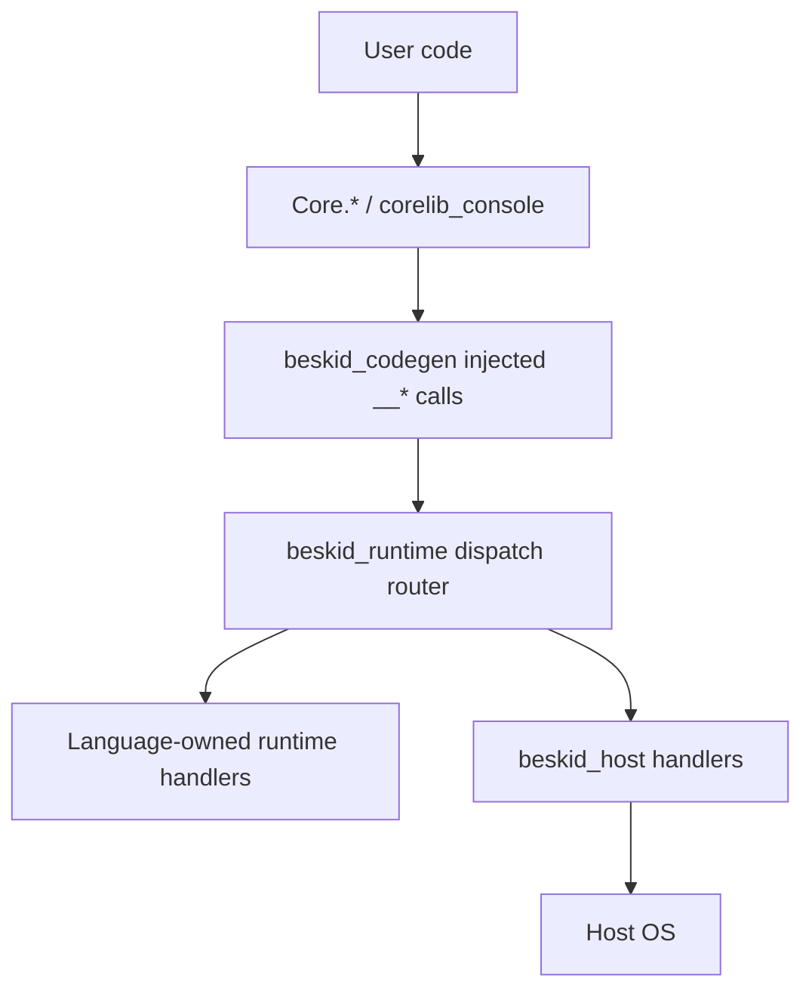

## Purpose

Some corelib modules are thin Beskid facades over **language runtime builtins**, **host-owned dispatch handlers**, and **OS syscalls**. ABI v4 makes that layering explicit: language semantics stay in `beskid_runtime`, while filesystem, environment, process, and TTY behavior are supplied by `beskid_host` in the `std` runtime profile.

Higher-level console and ANSI behavior lives in **`corelib_console`** (`compiler/corelib/packages/console`), not monolithic `IO.bd`.

## Layering

| Layer | Examples |
| --- | --- |
| **Beskid surface** | `Core.Input`, `Core.Output`, `Core.Error`, `Core.FS`, `Core.Syscall`, `Core.Time`, environment/process facades |
| **Console package** | ANSI and terminal helpers in `packages/console`; terminal-size fallback when host TTY returns `0` |
| **Language runtime module** | `alloc`, `fiber`, `channel`, `gc`, `panic_io`, clocks, strings, bytes in `beskid_runtime` |
| **Host module** | `fs_*`, `env_*`, `process_*`, `tty_winsize` handlers in `beskid_host` |
| **ABI catalog** | `compiler/runtime_manifest.toml` and generated `beskid_abi` tables pin symbol names, dispatch tags, owners, and signatures |

## Runtime profiles

| Profile | Surface behavior |
| --- | --- |
| `std` | Links `beskid_runtime` plus `beskid_host`; host-backed corelib surfaces are registered before user entry. |
| `minimal` | Links `beskid_runtime` only; language-owned surfaces work, while host-backed surfaces trap if called. |

`Runtime.Init` is a no-op stub in ABI v4. The host/link layer owns host registration through `beskid_host_register_all()`.

## Stability contract

Runtime-backed surfaces **must** keep ABI version alignment (`beskid_runtime_abi_version`, `BESKID_RUNTIME_ABI_VERSION` in AOT requests). Breaking builtin shapes requires coordinated bumps across:

- `compiler/runtime_manifest.toml`
- `beskid_abi` generated specs
- `beskid_runtime` language-owned implementations
- `beskid_host` host-owned implementations
- corelib Beskid declarations and docs under `compiler/corelib/beskid_corelib/docs/`

Language semantics (fiber scheduling, GC barriers) remain in **language-meta** and **execution** domains; this feature documents **which corelib entry points are native** and which native owner supplies them.

## Documentation sources

Trudoc-compatible prose lives beside Beskid sources in `compiler/corelib/`. Public site mirrors may appear under `site/website/src/legacy-bridge/corelib/Core/` for browsing.

## Implementation anchors

- Streams and Core facades: `compiler/corelib/packages/foundation/src/Core/`
- Console: `compiler/corelib/packages/console/`
- Language runtime: `compiler/crates/beskid_runtime/src/builtins/`
- Host runtime: `compiler/crates/beskid_host/`
- ABI manifest: `compiler/runtime_manifest.toml`
- ABI generated tables: `compiler/crates/beskid_abi/src/generated/`
- Tests: `compiler/crates/beskid_tests/src/abi/contracts.rs`
