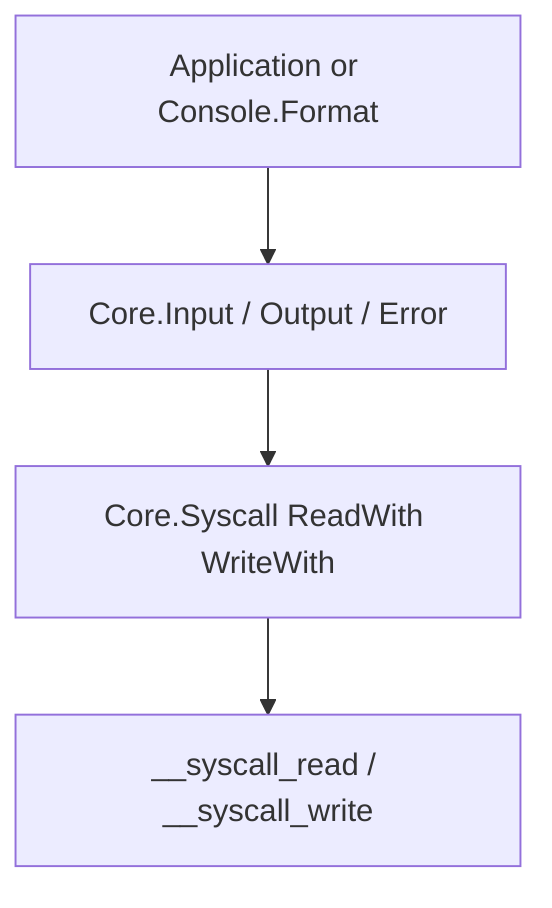

## Purpose

Define how **syscall-backed standard streams** are exposed as three Beskid modules (`Core.Input`, `Core.Output`, `Core.Error`) without leaking raw file descriptors or host APIs into user code.

## Canonical references

- Feature hub: [Console I/O streams](/platform-spec/core-library/terminal-and-console/console-io-streams/)
- Runtime syscall surface: [Panic, IO, and syscalls](/platform-spec/execution/runtime/panic-io-and-syscalls/)
- Normative requirement IDs **IO-001**–**IO-006**: [contracts and edge cases](./contracts-and-edge-cases/)
- Implementation: `compiler/corelib/packages/foundation/src/Core/Input/Input.bd`, `Output/Output.bd`, `Error/Error.bd`, `Syscall/`

## Detailed behavior

### Layering

**Console I/O streams** are thin facades: they select `Descriptor::Standard(StandardStream)` and translate Beskid `string` values to UTF-8 byte buffers. Styling, cursor motion, and color live in `corelib_console` and appear on stdout/stderr only as opaque UTF-8 after [ANSI escape model](/platform-spec/core-library/terminal-and-console/ansi-escape-model/) composition.

### Descriptor model (normative)

| `StandardStream` | Typical fd | Module | Read | Write |
| --- | --- | --- | --- | --- |
| `Stdin` | 0 | `Core.Input` | `Read`, `ReadLine` → `Result` | **Forbidden** |
| `Stdout` | 1 | `Core.Output` | **Forbidden** | `Write`, `WriteLine` |
| `Stderr` | 2 | `Core.Error` | **Forbidden** | `Write`, `WriteLine` |

User code **must not** pass integer fds to `ReadWith` / `WriteWith` for these helpers. Arbitrary descriptors, sockets, and pipes are out of scope for v1 stream modules; binary and raw-fd I/O lives in [Core.Syscall](/platform-spec/core-library/stability-and-api-shape/core-syscall/) (**SC-002**, **SC-003**), which is a superset profile of which console streams are the **SC-004** restricted subset.

### Syscall routing rules

- Every read **must** use `Syscall.ReadWith` with `Descriptor::Standard(Stdin)` only (**IO-001**).
- Every stdout write **must** use `Descriptor::Standard(Stdout)`; stderr **must** use `Stderr` (**IO-002**).
- `WriteLine(text)` **must** perform `Write(text)` then `Write("\n")` as LF only—no implicit CRLF in the API (**IO-003**, decision **D-TC-012**).
- Write failures **must** panic with stable messages; read paths **must** return `Result` (**IO-004**, **IO-005**).
- Stream modules **must not** parse or validate ANSI sequences (**IO-006**).

### Read vs write asymmetry

| Direction | API shape | Rationale |
| --- | --- | --- |
| Read | `Result<string, SyscallError>` | EOF and syscall errors are ordinary control flow |
| Write | Panic on failure | v1 CLI treats broken stdout as fatal |

### Relationship to `Console` facade

`Console.FormatLine` and control renderers **must** call `Core.Output` or `Core.Error` after producing a final string. They **must not** bypass syscall descriptors with host-specific writes. Capability probing runs in [Console capabilities](/platform-spec/core-library/terminal-and-console/console-capabilities/), not inside `Output.bd`.

## Verification

- Contract IDs **IO-001**–**IO-006** are enforced by runtime module structure and corelib integration tests that exercise stdin/stdout/stderr through the public API.
- Styled output paths are verified indirectly via console tests that call `Core.Output` after `Ansi` gating.

## Related topics

- [Flow and algorithm](./flow-and-algorithm/) — step-by-step read/write algorithms
- [Examples](./examples/) — `ReadLine`, `WriteLine`, and `FormatLine` usage
- [ANSI escape model](/platform-spec/core-library/terminal-and-console/ansi-escape-model/) — escape bytes written through stdout
- [Console terminal events](/platform-spec/core-library/terminal-and-console/console-terminal-events/) — tick loop writes after resize
