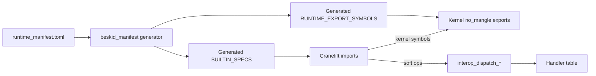

## Purpose

Document the **manifest-driven registry** that connects Beskid lowered code to the host runtime: a language-owned manifest generates symbolic names for the linker, Cranelift signatures, analysis builtins, JIT registration, and bridge anchors — split into **kernel** direct exports and **dispatch** entrypoints in ABI v3.

## Primary actors

| Actor | Artifact |
| --- | --- |
| **`runtime_manifest.toml`** | Normative classification of kernel vs dispatch ops |
| **`beskid_manifest` generator** | Emits generated Rust tables at build time |
| **`beskid_abi::builtins`** | Generated `BuiltinFnSpec { symbol, params, returns }` entries |
| **`beskid_abi::symbols`** | Generated `SYM_*` constants + `RUNTIME_EXPORT_SYMBOLS` (kernel-only in v3) |
| **`beskid_codegen`** | `declare_builtin_imports` builds Cranelift `FuncId`s from generated specs |
| **`beskid_runtime::builtins`** | Kernel `#[unsafe(no_mangle)] pub extern "C-unwind"` exports; soft impls via dispatch |

## Builtin families

| Family | v3 path | Consumer |
| --- | --- | --- |
| **Allocation / GC (kernel)** | Direct `alloc`, `gc_*` | All backends |
| **Faults / preempt (kernel)** | Direct `panic`, `runtime_preempt_check` | Traps and scheduling |
| **Dispatch (kernel entry)** | `interop_dispatch_{unit,ptr,usize}` | Soft op envelopes |
| **Soft ops (dispatch)** | Manifest tags → handler table | Strings, channels, fibers, IO, … |
| **Registration (kernel)** | `beskid_register_callbacks`, `beskid_register_handlers` | Host and corelib init |
| **Composition / dynamic (kernel, Phase A)** | Direct composition and dynamic symbols | DI and dynamic lowering |

Return kinds include **`AbiReturnKind::Never`** for diverging `panic` calls so Cranelift marks unreachable correctly.

## Data layout contracts

- **`BeskidStr`**: `{ ptr, len }` UTF-8 bytes (immutable; length in bytes).
- **`BeskidArray`**: `{ ptr, len, cap }`; element storage optional behind runtime `arrays_backing` feature ([Runtime feature flags](/platform-spec/execution/runtime/runtime-feature-flags/)).

## Registry diagram

## Implementation anchors
- `compiler/runtime_manifest.toml` — normative manifest input
- `compiler/crates/beskid_manifest/` — generator crate
- `compiler/crates/beskid_abi/src/generated/` — `BUILTIN_SPECS`, `RUNTIME_EXPORT_SYMBOLS`, `SYM_*`
- `compiler/crates/beskid_runtime/src/builtins/` — kernel exports and private soft implementations

## Related topics

- [ABI versioning](/platform-spec/execution/abi-and-host/abi-versioning-and-compatibility/) — when to bump version after symbol changes
- [Flow and algorithm](./flow-and-algorithm/)
