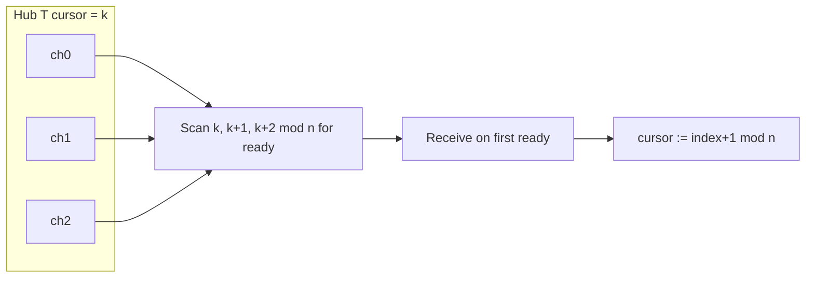

<SpecSection title="What this feature specifies" id="what-this-feature-specifies">
Runtime **channel** queues (**Send**, **Receive**, **TrySend**, **TryReceive**, **Close**), homogeneous `Hub<T>` multiplexing with round-robin **WaitReceive**, and **Mutex** / **WaitGroup** coordination. Cross-fiber data transfer is **channel-only**; successful **Send** *happens-before* observing **Receive**. Cancellation unblocks parked ops with `Cancelled` in **Result** after `OnCancelled` on the child fiber.
</SpecSection>

<SpecSection title="Implementation anchors" id="implementation-anchors">
- Builtins: `channel_*`, `hub_*`, `mutex_*`, `wait_group_*` in `compiler/crates/beskid_runtime/`
- ABI registry: `compiler/crates/beskid_abi/src/symbols.rs`, `define_builtins!`
- Corelib mapping: **[Concurrency package](/platform-spec/core-library/concurrency/concurrency-package/)**
</SpecSection>

<SpecSection title="Contract statement" id="contract-statement">
**Channels** are the **only** approved mechanism for passing data between fibers. The runtime implements bounded/unbounded queues with **Send** and **Receive** (full method names in corelib). **Hub** multiplexes many channels without a language `select`. **Mutex** and **WaitGroup** builtins back corelib structs.

Errors use **Result** / **Option**—never panic for closed, full, or cancelled operations.
</SpecSection>

<SpecSection title="Happens-before" id="happens-before">
A successful **Send** on `Channel<T>` *happens-before* a **Receive** that observes the value (Go/Java memory model style). Compiler **must not** allow passing stack pointers through **Channel**; values are copied or heap handles with GC tracing.

Phase B parallel mutators rely on these edges plus **gc_write_barrier** on pointer stores.
</SpecSection>

<SpecSection title="Hub" id="hub">
``Hub<T>`` maintains registered ``(index, channel: Channel<T>)`` pairs — **homogeneous ``T`` only in v1**. **WaitReceive** blocks until at least one member has a message available, then completes a **Receive** on that member.

**Fairness (normative):** **round-robin** — per-hub cursor starts at 0, scans registered indices in ascending order wrapping modulo registration set, chooses the **first ready** channel in that rotation. After success, cursor advances past the chosen index. Prevents starvation when a high-traffic channel is registered before a low-traffic one.

**WaitSend** is **out of scope for v1**. No language `select` in v1.

Full decision log: **[Concurrency package / decisions record](/platform-spec/core-library/concurrency/concurrency-package/decisions-record/)**.
</SpecSection>

<SpecSection title="Runtime builtins" id="runtime-builtins">
- `channel_create`, `channel_send`, `channel_receive`, `channel_try_send`, `channel_try_receive`, `channel_close`
- `hub_create`, `hub_register`, `hub_wait_receive`, …
- `mutex_lock`, `mutex_unlock`, `wait_group_add`, `wait_group_done`, `wait_group_wait`

## Cancellation

**Fiber.Cancel** sets cancellation flag, dispatches `OnCancelled` on the child fiber (language **event** on `Fiber<T>`), then unblocks parked **Receive**/**Send**/**Wait** with `Cancelled` in **Result**. **Join** on the child returns `FiberError::Cancelled`.
</SpecSection>

<SpecSection title="Blocking IO" id="blocking-io">
Syscall and console blocking **must** integrate with channel parking: producers **Send** bytes/events; consumers **Receive** on fibers. Raw syscall blocking on a fiber **must** park that fiber and offload blocking to the OS thread pool.
</SpecSection>

## Decisions

No open decisions. Closed choices are normative ADRs under **`adr/`** (`D-EXEC-RT-0012` … `D-EXEC-RT-0013`, `D-EXEC-RT-0016`); use the reader **ADRs** tab for expandable detail.
