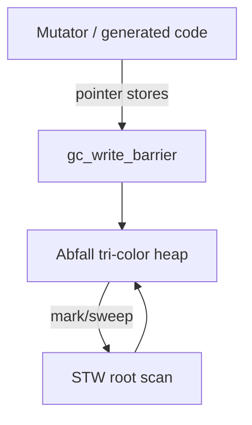

## Purpose

Normative model for **how Beskid heap objects live**, how the **Abfall** tri-color collector interacts with generated code, and how **Phase A** scheduling constrains mutators before parallel GC (Phase B).

## Primary actors

| Actor | Responsibility |
| --- | --- |
| **Compiler lowering** | Emits `alloc`, write barriers, stack maps, type descriptors |
| **`beskid_runtime::gc`** | `enter_runtime_scope`, heap attachment, `GcSnapshot` for hosts |
| **Abfall heap** | Concurrent mark/sweep with STW segments |
| **Fiber scheduler** | Ensures only one mutator runs Beskid allocations in Phase A |

## Object model

- Heap objects begin with a **type descriptor pointer** used for precise scanning.
- **`alloc(size, type_desc)`** creates descriptor-backed payloads via `abfall::Heap::allocate_beskid`.
- **Strings** use `BeskidStr`; **arrays** use `BeskidArray` headers (backing optional per feature flag).
- **Roots**: stacks (stack maps), globals (registered roots), external handles (`gc_root_handle`).

## GC architecture

**Tri-color** marking runs concurrently with the mutator where Phase allows; **write barriers** prevent black→white edges during marking. **STW** episodes are limited to root scanning and phase transitions.

## Phase A vs Phase B

| Phase | Mutators | Notes |
| --- | --- | --- |
| **A (current)** | One Beskid mutator at a time | Fibers swap on scheduler threads; syscall pool workers **must not** allocate as mutators |
| **B (target)** | Parallel mutators with barriers | Requires full stack-map coverage and scheduler coordination |

See [Fiber scheduler and stacks](/platform-spec/execution/runtime/fiber-scheduler-and-stacks/) for parking and safepoints.

## Implementation anchors
- `compiler/crates/beskid_runtime/src/gc.rs` — GC arena, write barriers, and collection cycle
- `compiler/crates/beskid_runtime/src/runtime/` — `GcSnapshot`, mutator attachment, and arena access
- `compiler/crates/abfall/src/` — tri-color marking and heap implementation

## Related topics

- [Flow and algorithm](./flow-and-algorithm/)
- Legacy: [Concurrent GC](../../../../execution/memory/gc.md)
