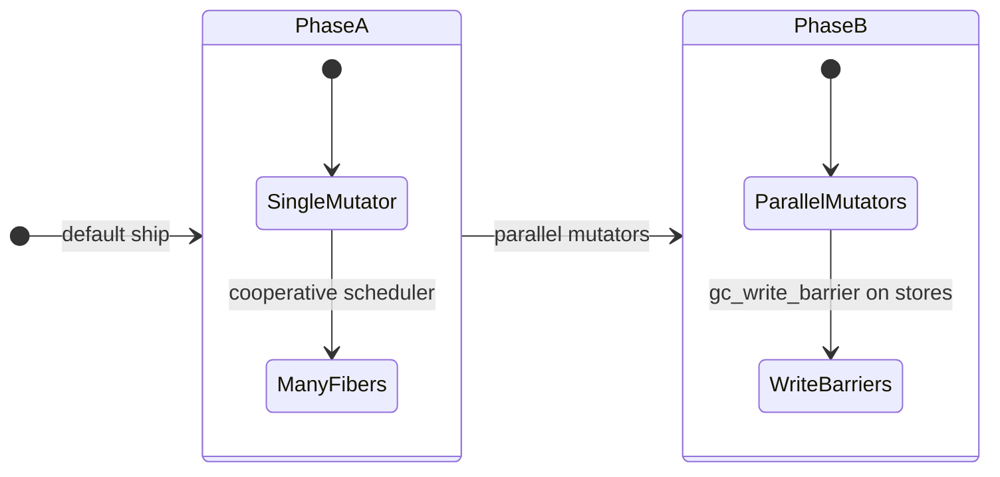

<SpecSection title="What this feature specifies" id="what-this-feature-specifies">
`Memory and GC runtime contract` defines one operational contract that a newcomer can follow end-to-end: first the model, then execution flow, then strict guarantees, concrete examples, and verification guidance.
</SpecSection>

<SpecSection title="GC phases" id="gc-phases">

Phase A: many fibers, **one GC mutator** thread. Phase B: parallel mutators with insertion barriers; see [design model](./design-model/) for builtin tables.

</SpecSection>

<SpecSection title="Implementation anchors" id="implementation-anchors">
- Runtime memory exports in `compiler/crates/beskid_runtime/src/lib.rs`
- ABI contracts in `compiler/crates/beskid_abi/src/lib.rs`
- JIT linking and call setup in `compiler/crates/beskid_engine/src/jit_module.rs`
- Runtime integration tests in `compiler/crates/beskid_tests/src/runtime/jit.rs`
</SpecSection>

## Decisions
<!-- spec:generate:adr-index -->
No open decisions. Closed choices are normative ADRs under **`adr/`** (`D-EXEC-RT-0005` … `D-EXEC-RT-0007`); use the reader **ADRs** tab for expandable detail.
<!-- /spec:generate:adr-index -->
## Articles
<!-- spec:generate:article-index -->
- [Contracts and edge cases](./articles/contracts-and-edge-cases/)
- [Design model](./articles/design-model/)
- [Examples](./articles/examples/)
- [FAQ and troubleshooting](./articles/faq-and-troubleshooting/)
- [Flow and algorithm](./articles/flow-and-algorithm/)
- [Verification and traceability](./articles/verification-and-traceability/)
<!-- /spec:generate:article-index -->
