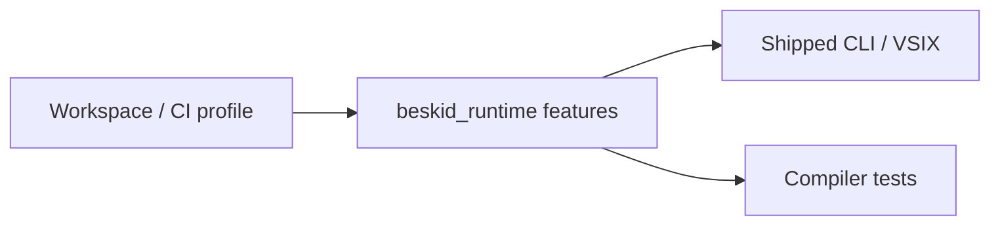

## Purpose

Document **optional runtime capabilities** selected at **build time** via Cargo features. These differ from **`BESKID_RUNTIME_ABI_VERSION`**: features toggle code paths without changing the baseline symbol list unless a feature adds new exports.

## Primary actors

| Actor | Role |
| --- | --- |
| **`beskid_runtime` Cargo.toml** | Declares `metrics`, `arrays_backing`, `sched` features |
| **Maintainers / CI** | Builds runtime with agreed feature set for CLI, VSIX, releases |
| **Compiler tests** | Enable features when validating optional behavior |
| **Tooling** | Documents which flags are on in prebuilt binaries |

## Feature catalog (reference tree)

| Feature | Effect |
| --- | --- |
| **`arrays_backing`** | `array_new` allocates element storage; without it, header-only arrays (`ptr = null`) |
| **`metrics`** | Extra `rt_metrics_*` exports for heap/alloc/event counters |
| **`sched`** | Scheduler internals/experimental hooks (build-time; not user-facing) |
| **`extern_dlopen`** (engine, not runtime) | Dynamic extern resolution — see [Extern dispatch](/platform-spec/execution/abi-and-host/extern-dispatch-and-policy/) |

## Alignment model

Shipped artifacts **must** document enabled features. Mixing a compiler test build that expects `arrays_backing` against a default runtime produces logical failures without ABI version mismatch.

## Implementation anchors
- `compiler/crates/beskid_runtime/Cargo.toml` — `[features]` definitions (`arrays_backing`, `metrics`)
- `compiler/crates/beskid_runtime/src/builtins/arrays.rs` — `arrays_backing` gated array builtins
- `compiler/crates/beskid_engine/Cargo.toml` — `extern_dlopen` engine feature

## Related topics

- [Flow and algorithm](./flow-and-algorithm/)
- [Builtins and symbols](/platform-spec/execution/abi-and-host/builtins-and-symbols/)
