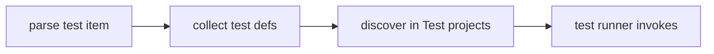

## Vocabulary

| Construct | Role |
| --- | --- |
| **`TestDefinition`** | `test Name { body }` item with optional meta/skip |
| **`TestMetaSection`** | `meta { key = expr; }` inside test body |
| **`TestSkipSection`** | `skip { key = expr; }` conditional skip predicates |
| **`TestMetadataEntry`** | Single `name = expr` entry in meta or skip |

## Test architecture

Tests are **first-class module items**, not attributes on functions. The compiler parses them into dedicated AST nodes.

### Subsystem boundaries

| Subsystem | Responsibility | Key file |
| --- | --- | --- |
| Parser | Parse `test`, `meta`, `skip` | `syntax/items/test_definition.rs` |
| AST | Store test structure | `syntax/items/test_definition.rs` |
| Formatter | Emit test items | `format/items/tests_emit.rs` |
| Tooling | Discover and run tests | `beskid test` CLI |

## Test project kind

Tests should appear in `Test` projects. Placement in `App`/`Lib` projects may warn per manifest policy.

## Meta and skip sections

- `meta { timeout = 30; }` attaches metadata parsed as `TestMetaSection`.
- `skip { condition = expr; }` marks conditional skip predicates.
- Both use `TestMetadataEntry` nodes with `Identifier` name and `Expression` value.
