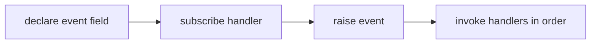

## Vocabulary

| Construct | Role |
| --- | --- |
| **`event` field** | Multicast callback slot declared on a `type` |
| **`EventCapacity`** | Optional capacity hint for bounded subscriber lists |
| **`TypeInvalidEventInvocationScope`** | Diagnostic for invalid event usage |

## Event architecture

Events are **multicast callback slots** declared as fields on types. They are not ordinary value fields and must not be read like variables.



### Subsystem boundaries

| Subsystem | Responsibility | Key file |
| --- | --- | --- |
| Parser | Parse `event` fields on types | `syntax/items/type_definition.rs` (field parsing) |
| AST | Store event field structure | `syntax/items/type_definition.rs` |
| Type checker | Validate event signatures | `types/context/expressions.rs` |
| Runtime | Manage subscriber lists | `beskid_runtime/src/builtins/events.rs` |

## Declaration

```beskid
type Button {
    event Clicked(i32 x, i32 y);
}
```

Event fields are parsed as part of the `FieldList` in `TypeDefinition`. The parser distinguishes event fields from value fields by the `event` keyword.

## Dynamic semantics

- **Multicast** — Multiple subscribers may be registered; raise invokes subscribers in registration order.
- **Synchronous default** — Handlers run on the raising fiber unless a host profile says otherwise.
- **Lifetime** — Subscriptions should be detached when the owning object is disposed; leaks are host-defined.
