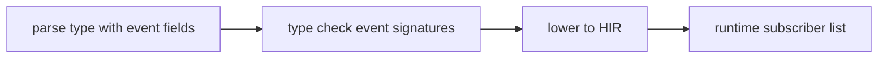

## Compile pipeline placement

## Event parsing algorithm (normative)

1. **Parse type definition** — `TypeDefinition` collects fields via `FieldList`.
2. **Distinguish event fields** — Fields starting with `event` are parsed as event declarations with parameter lists.
3. **Validate event signatures** — Event signatures must use parameter lists compatible with delegate lowering. `TypeInvalidEventCapacity` (**E1220**) for invalid capacity hints.
4. **Check invocation scope** — Raising or subscribing must target an in-scope event member on a value or `this`-equivalent receiver. `TypeInvalidEventInvocationScope` (**E1219**) otherwise.
5. **Check subscription target** — `TypeInvalidEventSubscriptionTarget` (**E1221**) for invalid subscription targets.

## Runtime subscriber management

The runtime maintains a subscriber list per event instance:
1. **Subscribe** — Add a handler delegate to the list.
2. **Raise** — Iterate the list and invoke each handler with the provided arguments.
3. **Unsubscribe** — Remove a handler delegate from the list.

## Fiber cancellation events

Fiber cancellation uses the same `event` mechanism on `Fiber<T>`. See [Fibers and spawn](/platform-spec/language-meta/evaluation/fibers-and-spawn/) for details.

## LSP / incremental

Re-run event checking when type definitions with event fields or event usage expressions change.
