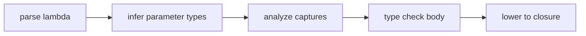

## Vocabulary

| Construct | Role |
| --- | --- |
| **`LambdaExpression`** | Anonymous function `params => body` |
| **`LambdaParameter`** | Single parameter with optional explicit type |
| **`LambdaParameters`** | Parameter list (single identifier or parenthesized list) |

## Lambda architecture

Lambdas are **expression-level anonymous functions** with optional parameter types. They may appear anywhere an `Expression` is allowed.

### Subsystem boundaries

| Subsystem | Responsibility | Key file |
| --- | --- | --- |
| Parser | Parse `=>` syntax | `syntax/expressions/lambda_expression.rs` |
| AST | Store lambda structure | `syntax/expressions/expression.rs` |
| Type checker | Infer parameter types from context | `types/context/expressions.rs` |
| Capture analysis | Track captured locals | `analysis/rules/staged/` |
| HIR lowering | Build closure environment | `hir/lowering/expressions.rs` |

## Capture model

- Captured locals must be definitely assigned before capture.
- Lambdas must not capture `mut` bindings unless the implementation explicitly allows it.
- A closure extends the lifetime of captured storage to at least the closure value's lifetime.
- Captured reference-bearing values must be heap-traced when they escape the frame.
