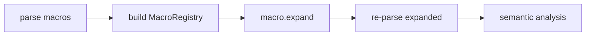

## Vocabulary

| Construct | Role |
| --- | --- |
| **`MacroDefinition`** | `macro name (params) { body }` item |
| **`MacroInvocation`** | `name!(args)` or `name! { block }` expression |
| **`MacroRegistry`** | Maps macro names to definitions in the compilation unit |
| **`MacroParameter`** | Fragment kind + name pair in macro definition |

## Macro architecture

Language macros are **first-class module items** expanded by the compiler before semantic analysis. Expansion is structural: the compiler substitutes captured syntax fragments for `$param` references.

### Subsystem boundaries

| Subsystem | Responsibility | Key file |
| --- | --- | --- |
| Parser | Parse `macro` and `!` invocations | `syntax/items/macro_definition.rs` |
| AST | Store macro structure | `syntax/expressions/macro_invocation.rs` |
| Macro registry | Collect and lookup definitions | `macros/registry.rs` |
| Expansion | Substitute fragments and splice | `macros/match_args.rs` |
| Semantic | Analyze expanded code | `analysis/rules/staged/` |

## Fragment kinds (v1)

Closed vocabulary for parameter kinds: `block`, `expression`, `statement`, `type`, `identifier`, `literal`, `pattern`, `path`, `item`, `node`.

## Depth cap

Default maximum expansion depth is 32 per compilation unit. `MacroExpansionDepthExceeded` (**E1905**) fires when the cap is reached.
