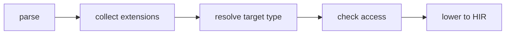
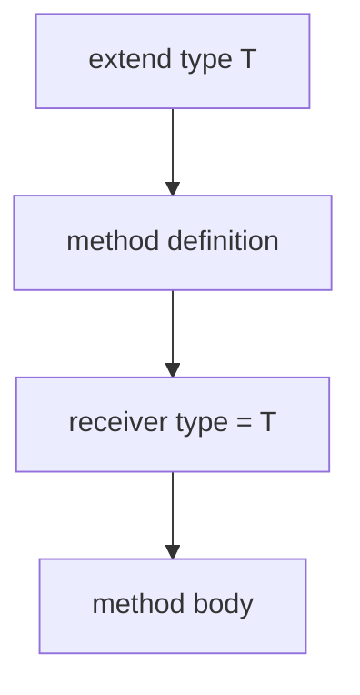

## Compile pipeline placement

## extend type algorithm (normative)

1. **Parse extension block** — `extend type T { methods }` becomes `ExtendTypeDefinition` with `target_type` and `methods`.
2. **Parse methods** — Each method is parsed with the target type as its implicit receiver type.
3. **Resolve target type** — The extended type name must refer to an in-scope type declaration.
4. **Index methods** — Add extension methods to the target type's member set for dispatch resolution.
5. **Check access rules** — `ExtendTypePrivateMemberAccess` (**E1511**) prevents access to private members of the extended type.
6. **Check visibility** — Extension sites must satisfy normal import and visibility rules.
7. **Lower to HIR** — Methods are lowered as ordinary function definitions with the receiver type bound.

## Method parsing with receiver

## Compiler mod generation

Mods may emit `extend type` blocks through `Generator` contracts:
1. Mod code constructs `ExtendTypeDefinition` nodes via the typed AST API.
2. The host merges generated contributions into the program.
3. Re-parse and re-resolve treat generated extensions the same as hand-authored ones.

## LSP / incremental

Re-run extension analysis when `extend type` blocks, target type definitions, or method signatures change.
