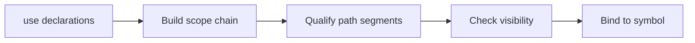

## Vocabulary

| Construct | Role |
| --- | --- |
| **`Resolver`** | Central name resolution state |
| **`Scope`** | Hierarchical binding container |
| **`ValuePath`** | Path resolving to functions, locals, constants, enum constructors |
| **`TypePath`** | Path resolving to types, generics, primitives |

## Resolution architecture

Name resolution is **single-pass** with a shared snapshot per compilation. The package driver and typechecker share one resolver graph.

### Subsystem boundaries

| Subsystem | Responsibility | Key file |
| --- | --- | --- |
| Parser | Parse `use` and paths | `syntax/items/use_declaration.rs` |
| Resolver | Build scope chain and bind names | `resolve/resolver.rs`, `resolve/collect.rs` |
| Resolve refs | Walk AST and resolve references | `resolve/resolve_refs.rs` |
| Name resolution rules | Emit resolution diagnostics | `analysis/rules/staged/name_resolution.rs` |

## Scope chain

Resolution walks from innermost scope outward:
1. Local scope (function/lambda parameters and `let` bindings)
2. Module scope (items in the current module)
3. Import scope (`use` bindings)
4. Global scope (prelude and built-in types)

## Shadowing

Inner scopes may shadow outer locals. `ResolveShadowedLocal` (**W1103**) warns when shadowing occurs.
