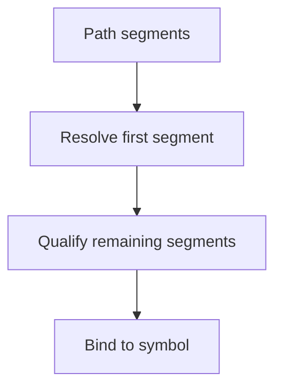

## Compile pipeline placement

## Resolution algorithm (normative)

1. **Collect definitions** — Walk all items and build a name-to-definition map per module scope.
2. **Process imports** — Resolve `use` paths and add imported names to the module scope. `UnknownImportPath` (**E1105**) for invalid paths.
3. **Build scope chain** — For each function/lambda, create a local scope with parameters and `let` bindings.
4. **Resolve value paths** — Walk expressions and bind identifiers to value symbols. `ResolveUnknownValue` (**E1101**) for unresolved names.
5. **Resolve type paths** — Walk type expressions and bind identifiers to type symbols. `ResolveUnknownType` (**E1201**) for unresolved types.
6. **Check visibility** — Verify that resolved symbols are accessible from the reference site. `ResolvePrivateItemInModule` (**E1107**) for private access.
7. **Check duplicates** — `ResolveDuplicateItem` (**E1102**) and `ResolveDuplicateLocal` (**E1102**) for duplicate names in the same scope.
8. **Handle shadowing** — `ResolveShadowedLocal` (**W1103**) warns when an inner binding shadows an outer one.

## Path resolution

## Contract namespaces

Contracts may appear as path prefixes for static-style calls (`Contract.method()`). The resolver provides contract-as-namespace fallback when a direct value binding is not found.

## LSP / incremental

Re-run resolution when `use` declarations, item definitions, or local bindings change.
