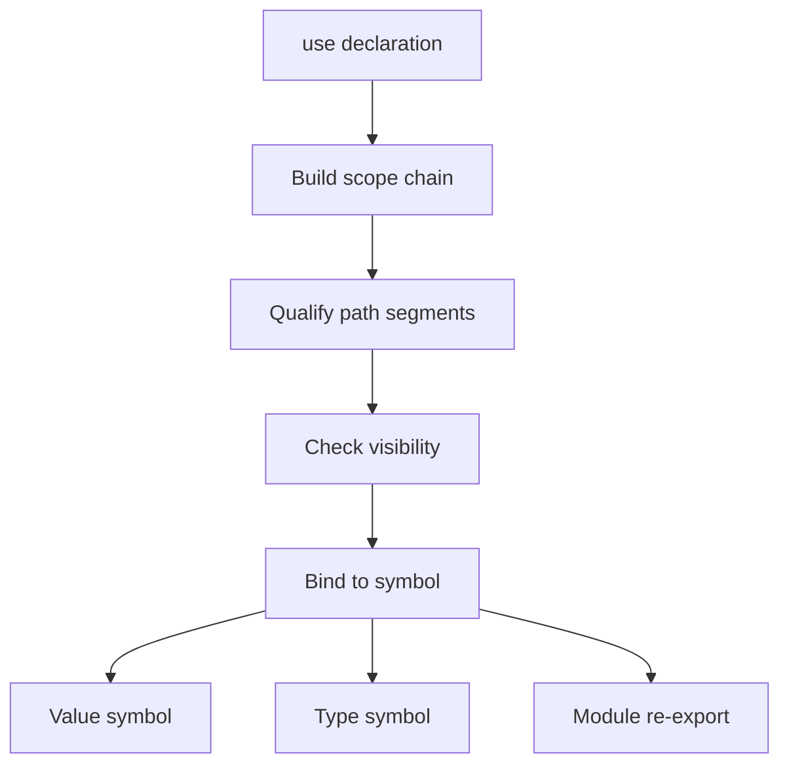

## Resolution flow

## Normative specification

### Scope

Defines how **identifiers** and **paths** bind to program items across modules. Module shape is in [Modules and visibility](/platform-spec/language-meta/program-structure/modules-and-visibility/).

### `use` declarations

- **`use Path;`** imports the final segment into the current scope.
- **`use Path as Alias;`** binds the resolved target to `Alias`.
- **`use` before declaration** in the same module **must** error (**E1106**) when forward reference is illegal.
- Unknown import paths **must** error (**E1105**); ambiguous imports **must** error (**E1104**).

### Value and type paths

- **Value paths** resolve to functions, locals, constants, enum constructors, and contract namespaces.
- **Type paths** resolve to types, generics, and primitive names.
- Unresolved value **E1101**; unresolved type **E1201**; unknown module segment **E1108**.

### Locals and shadowing

- Inner scopes **may** shadow outer locals; shadowing **should** warn (**W1103**).
- Duplicate definitions in the same scope **must** error (**E1006**, **E1102**).

### Static rules

- Resolution **must** respect visibility from the importer’s module.
- Generic parameters shadow type names in signature scope only for the declaring signature.

### Dynamic semantics

Resolution is compile-time; emitted metadata records stable `qualifiedName` strings for tooling.

### Diagnostics

Import band **E1104–E1108**; resolve duplicates **E1102**. Registry: [Diagnostic code registry](/platform-spec/compiler/semantic-pipeline/diagnostic-code-registry/).

### Conformance

**L1** resolver tests **must** pass for cross-module `use` and private item rejection.

## Decisions
<!-- spec:generate:adr-index -->
No ADRs published under **`adr/`** yet.
<!-- /spec:generate:adr-index -->
## Articles
<!-- spec:generate:article-index -->
- [Name resolution - Contracts and edge cases](./articles/contracts-and-edge-cases/)
- [Name resolution - Design model](./articles/design-model/)
- [Name resolution - Examples](./articles/examples/)
- [Name resolution - FAQ and troubleshooting](./articles/faq-and-troubleshooting/)
- [Name resolution - Flow and algorithm](./articles/flow-and-algorithm/)
- [Name resolution - Verification and traceability](./articles/verification-and-traceability/)
<!-- /spec:generate:article-index -->
