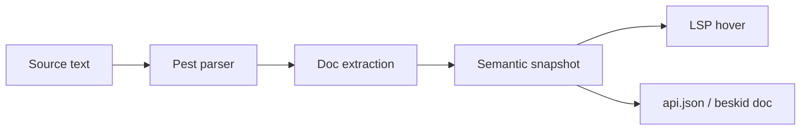

## Design overview

Documentation comments (`///`) provide a structured surface for attaching human-readable contracts to declarations. Unlike ordinary comments, doc runs are preserved through formatting, refactoring, and LSP operations — they form part of the semantic snapshot.

## Architecture

The doc comment pipeline follows a three-stage architecture:

### Stages

1. **Parsing** — `beskid.pest` identifies `DocRun` productions through `ItemWithDocs` and parameter/method/variant doc wrappers.
2. **Extraction** — The compiler extracts doc text from the parsed AST during semantic analysis. Located in `beskid_analysis/src/doc/`.
3. **Consumption** — Tooling consumes doc text through semantic snapshots (LSP hover) or `api.json` output (`beskid doc`).

## Relationship to api.json

`beskid doc` emits [api.json schema v4](/platform-spec/tooling/cli/api-json-contract/design-model/) with compiler-derived signatures and type links for every resolved symbol. Authors do not duplicate type names in JSON: non-primitive types use `typeAnnotation.refItemId` for navigation; optional `///` prose uses `@ref(Qualified.Name)` for markdown cross-links in `docMarkdown` and structured `summaryMarkdown`.

**`@ref` resolution** prefers `symbolKey` when the target row carries one, then falls back to the same `qualifiedName` index as other `api.json` navigation (not raw declaration `name` alone). Packed docs emit registry links of the form `/docs/{package}@{version}/api/{qualifiedName}` when a publish context is available; cross-package targets use the target row's `declaringPackage` when present.

## Key design decisions

| ID | Decision | Rationale |
|---|---|---|
| D-LM-DOC-001 | `///` only | Block and `//` comments never form API documentation. |
| D-LM-DOC-002 | Non-normative doc | Doc comments cannot introduce new MUST rules. |
| D-LM-DOC-003 | `@arg` on callables only | Parameter tags apply to functions, methods, and contract methods — not record fields. |
| D-LM-DOC-004 | Signatures from compiler | `api.json` types and links are compiler-derived; prose must not invent parallel type strings. |

## Related articles

- [Contracts and edge cases](../contracts-and-edge-cases/)
- [Verification and traceability](../verification-and-traceability/)
