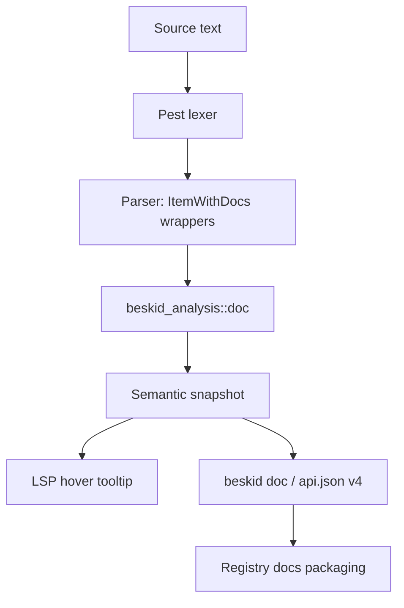

## Processing pipeline

The doc comment pipeline processes `///` runs through several stages from source to tooling consumption.

## Data flow

## Stage details

### 1. Lexing and parsing

`beskid.pest` defines `DocRun` as consecutive `///` lines. The grammar enforces:
- `///` tokens are captured only inside `ItemWithDocs` or parameter/method/variant doc wrapper productions.
- `////` and `/////` sequences are parsed as comments, not doc runs.

### 2. Doc extraction

The compiler crate `beskid_analysis/src/doc/` extracts doc text from the parsed HIR and produces structured doc records. The `doc_comment_parser.rs` file handles `@arg` and `@ref` tag resolution within doc bodies.

### 3. Semantic snapshot attachment

Doc text is stored alongside resolved symbols in the semantic snapshot. This ensures LSP hover and IDE features have fast access to documentation without re-parsing.

### 4. Tooling consumption

- **LSP hover** reads doc text directly from the semantic snapshot.
- **`beskid doc`** emits `api.json` with doc text in `docMarkdown` and `summaryMarkdown` fields, resolved `@ref` links as structured `see` references, and format-appropriate `@arg` entries for callables.
- **Registry packaging** integrates with publish flow when available.

## Key processing rules

- Doc text is preserved through formatting without reordering (`beskid fmt` must not reorder `///` across item boundaries).
- `@ref` resolution prefers `symbolKey` then falls back to `qualifiedName`.
- Cross-package `@ref` targets use `declaringPackage` when present.
