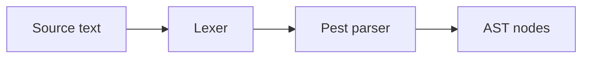

## Vocabulary

| Construct | Role |
| --- | --- |
| **`beskid.pest`** | Authoritative grammar file (single syntactic truth) |
| **`Identifier`** | ASCII letter or `_` followed by alphanumeric/`_` |
| **`Keyword`** | Reserved tokens (for example `type`, `enum`, `if`, `host`) |
| **`Literal`** | Integer, float, string, char, or **`code`** fenced literal |

## Lexical architecture

The lexical layer tokenizes source text into a stream consumed by the pest parser. All later phases assume the token boundaries defined here.



### Subsystem boundaries

| Subsystem | Responsibility | Key file |
| --- | --- | --- |
| Lexer | Tokenize source | `beskid.pest` (implicit via pest) |
| Parser | Build AST from tokens | `parser.rs`, `parsing/parsable.rs` |
| AST | Store syntax structure | `syntax/` directory |
| Formatter | Pretty-print from AST | `format/` directory |

## Lexical rules

- Whitespace is insignificant except as a separator.
- Identifiers must match `Identifier` production and must not spell a reserved `Keyword`.
- Integer and float literals follow pest productions; no implicit radix or suffix.
- String literals support `"..."` with escapes `\"`, `\\`, `\${`, and `${ expression }` interpolation.
- **`code`** literals use markdown-style fences: `code ```lang` newline body closing `` ``` `` on its own line. Default language tag is **`beskid`**. Non-`beskid` tags store body text verbatim (no parse, no `@{}` evaluation). In **`beskid`** bodies, **`@{ expression }`** holes are Beskid expressions evaluated at **mod generate time** by the host (distinct from runtime `${ expression }` string interpolation).
- Char literals use single quotes with `\'` escape.
- `//` line comments (not starting a third `/`) are ordinary comments.
- `///` on items begins a documentation run; `////` and longer are not documentation.
- `/* ... */` block comments nest by terminator only.

## Program structure

A compilation unit is `Program = ItemList` terminated by end of input. Top-level items must be one of: `host`, `macro`, function, `impl`, `extend type`, `type`, `enum`, `contract`, `test`, `attribute`, inline `mod`, `mod` declaration, or `use`.
