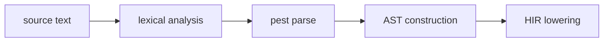

## Compile pipeline placement

## Parsing algorithm (normative)

1. **Read source** — Load source text from file or editor buffer.
2. **Tokenize** — Pest grammar `beskid.pest` drives implicit tokenization.
3. **Parse program** — `Program = ItemList` matches top-level items.
4. **Construct AST** — Each pest rule maps to an AST node via `Parsable` trait implementations.
5. **Attach spans** — Every AST node carries a `SpanInfo` for diagnostic reporting.
6. **Attach docs** — Leading `///` runs are attached to items via `ItemWithDocs` wrappers.
7. **Report parse errors** — Malformed input emits parser diagnostics (no stable `E####` band in v0.1).
8. **Early structural checks** — HIR construction discovers issues like invalid nesting; **E1151–E1154**.

## Type syntax precedence

Type syntax order of precedence (highest to lowest):
1. `ArrowFunctionType`
2. `FunctionType`
3. `T[]`
4. `TypeName`

## Generic parameter lists

Use angle brackets: `<T, U>`. Generic parameters shadow type names in signature scope only.

## LSP / incremental

Re-parse when source text changes. Incremental parsing may be optimized by tracking changed regions.
