## Compile pipeline placement

Type checking runs on the **lower spine** under pipeline phase id **`lower.type_check`**, after HIR normalize and post-normalize resolution:

```mermaid
flowchart LR
    parse[parse]
    lower[lower AST to HIR]
    resolve1[resolve pass 1]
    normalize[normalize HIR]
    resolve2[re-resolve]
    index[index_program]
    surface[surface pass]
    check[TypeChecker::check_entry]
    prep[lowering prep]
    codegen[codegen]
    parse --> lower --> resolve1 --> normalize --> resolve2 --> index --> surface --> check --> prep --> codegen
```



Orchestration lives in [`typed_hir_from_lowered`](compiler/crates/beskid_analysis/src/services/lower.rs). For the full contract, see [Type-system pass contract](/platform-spec/compiler/semantic-pipeline/type-system-pass-contract/flow-and-algorithm/).

## Type declaration collection algorithm

1. **Parse program** — `Program = ItemList` from `beskid.pest`; each `TypeDefinition` and `EnumDefinition` becomes an AST node.
2. **Collect definitions** — `analysis/rules/staged/definitions.rs` walks items and builds a name-to-definition map.
3. **Check duplicates** — `DuplicateDefinitionName` (**E1001**) and `DuplicateItemName` (**E1006**) fire when names collide in the same scope.
4. **Validate conformance targets** — `ResolveInvalidConformanceTarget` (**E1607**) checks that `: Contract` paths resolve to actual contract definitions.

## `lower.type_check` algorithm (normative)

### Step 0 — Index HIR nodes

```text
index_program(&mut hir)
```

Assign dense `HirNodeId` values to every typable `Spanned<T>` in pre-order. This runs **after normalize** and **before** any type sub-pass reads `node.id`.

### Step 1 — Surface pass

For each unit in the typing scope (entry plus dependencies per [`DependencyTypingPolicy`](/platform-spec/compiler/semantic-pipeline/type-system-pass-contract/flow-and-algorithm/)):

1. Load or build [`UnitTypeSurface`](compiler/crates/beskid_analysis/src/types/surface.rs) via `build_unit_type_surface`.
2. Merge dependency surfaces into `MergedTypeEnv` for entry body checking.
3. Store per-unit surfaces in `TypeResult.unit_surfaces`.

### Step 2 — Check pass

Run [`TypeChecker::check_entry`](compiler/crates/beskid_analysis/src/types/checker/entry.rs):

1. **Seed primitives** — `TypeChecker::new` initializes primitive mappings (`bool`, `i32`, `i64`, `u8`, `f64`, `char`, `string`, `unit`) in the hash-consed `TypeTable`.
2. **Register declarations** — Seed struct, enum, generic, contract, and method receiver metadata from merged surfaces and entry items.
3. **Walk items** — `type_item` checks each top-level item; expression and statement typing records `node_types[HirNodeId]`.
4. **Check field types** — Every field in a type declaration must resolve to a known type; `UnknownTypeInDefinition` (**E1005**) otherwise.
5. **Check generic arity** — Use sites must supply the correct number of arguments; `TypeMissingTypeArguments` (**E1203**) or `TypeGenericArgumentMismatch` (**E1204**) otherwise.
6. **Check member access** — `TypeInvalidMemberTarget` (**E1213**) when the receiver type does not expose the accessed member.
7. **Solve constraints** — `TypeChecker::finish` runs `solve_constraints` for inference sites; ambiguity emits **E1202**.

### Step 3 — Lowering prep pass

`LoweringPrep::run` walks the typed tree and records `call_kinds` and `cast_intents` keyed by `HirNodeId`. Array bounds checks are inserted at codegen time unless proven safe.

### Step 4 — Assemble `TypeResult`

Merge surfaces, `node_types`, signatures, and lowering metadata. On any `TypeError`, fail with `LowerResolveTypeError::Type`.

## Primitive lowering

Primitives map directly to `HirPrimitiveType` variants:

| Surface | HIR variant |
| --- | --- |
| `bool` | `Bool` |
| `i32` | `I32` |
| `i64` | `I64` |
| `u8` | `U8` |
| `f64` | `F64` |
| `char` | `Char` |
| `string` | `String` |
| `unit` | `Unit` |

## Type path resolution

Named types (`Path` with optional `GenericArguments`) resolve through the same scope chain as value paths:
- Local generic parameters shadow outer type names.
- Imported types via `use` participate in resolution.
- Unknown type paths emit `TypeUnknownType` (**E1201**).

## LSP / incremental

Re-run surface and check passes when `TypeDefinition`, `EnumDefinition`, field shapes, or generic parameter lists change. Per-unit surfaces are cached via Salsa (`unit_type_surface_tracked`); importers are evicted through the unit import graph.
