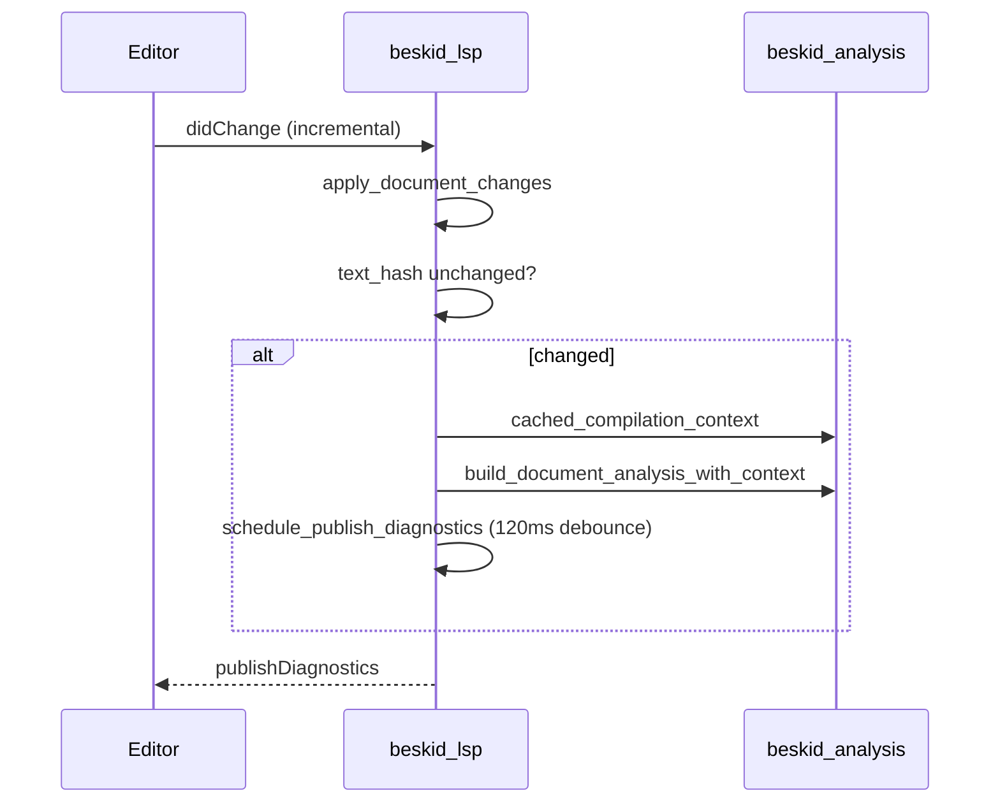

## Open document refresh

1. Apply LSP content changes to the open `Document`.
2. If text hash unchanged and version monotonic, skip re-analysis.
3. Otherwise rebuild `DocumentAnalysisSnapshot` using cached `CompilationContext`.
4. Coalesce diagnostic publish jobs per URI revision counter.

## Workspace scan algorithm

`scan_workspace(root, focused_project)`:

1. Walk directory tree, skipping `.git`, `target`, `node_modules`, `.beskid`, `out`, `bin`, `obj`, `.vs`.
2. Collect `.bd` and manifest paths; cap concurrent reads (`MAX_CONCURRENT_READS = 24`).
3. Call `invalidate_compilation_cache` before indexing when graph scope may have changed.
4. For each path, `analyze_document` or hydrate disk snapshot via `set_disk_snapshot` when not open.
5. Emit progress every 25 files or 200ms; finish with `phase: idle`.

Focused project URI steers which `Project.proj` seeds `CompilationContext` when a source file has ambiguous workspace membership.

## External disk change

`refresh_after_disk_change` and `hydrate_disk_after_close` re-read closed files into `workspace_index` without clobbering open buffers. Manifest edits trigger cache invalidation then a full or scoped rescan from `backend.rs` configuration handlers.

## Feature requests and snapshots

IDE features (`completion`, `hover`, `definition`, …) snapshot document text through `protocol/request.rs` helpers so handlers observe a consistent parse tree for the debounced generation.

## Tests

`compiler/crates/beskid_tests/src/analysis/resolve.rs` covers resolver behavior consumed by LSP project context; extend LSP-specific tests when changing invalidation or scan skip rules.
