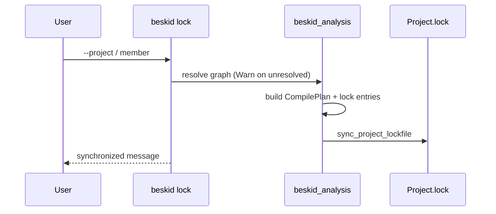

## `beskid lock` flow

1. Resolve workspace member or standalone `Project.proj`.
2. Walk dependencies (path + registry), applying workspace overrides.
3. Materialize or verify package roots per policy.
4. Serialize `ProjectLockfileV1` beside the root manifest.
5. Skip write when on-disk lock already matches expected content.

## `beskid fetch` / `beskid update`

- **`fetch`** resolves registry aliases to URLs (`registry_urls`), downloads packages via **`beskid_pckg`**, and lays out materialized roots referenced by future lock lines.
- **`update`** reapplies resolution with a stricter unresolved policy (typically failing on drift) and refreshes materialized trees.

Both commands **must** share graph construction with `lock` so CI and local machines produce comparable `materialized_root` paths.

## LSP lock replay

When the language server lacks an in-memory prepared workspace:

1. Read `Project.lock` from the project root.
2. `effective_roots_from_lockfile` seeds dependency manifest paths.
3. Subsequent analysis uses the same roots until invalidation.

## Corelib path injection during resolve

While walking the DAG, host projects without explicit `Std` receive implicit corelib path attachment (`default_corelib_dependency_path` in `resolver.rs`). Workspace shards under `compiler/corelib/packages/*` **must not** create cyclic back-links to the aggregate `beskid_corelib` package.

## Tests

`compiler/crates/beskid_tests/src/analysis/pipeline/core.rs` and `projects/corelib/layout.rs` exercise workspace + lock layouts.
