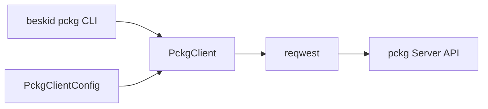

## Purpose

`beskid_pckg` is the single HTTP client for the **pckg** registry service. The CLI exposes it as `beskid pckg <subcommand>`; analysis-time fetch uses the same `PckgClient` types. Server behavior for published artifacts is implemented in `pckg/src/Server/` (validation, docs ingestion, workspace bundles).

## Component model

| Piece | Role |
| --- | --- |
| **`PckgClientConfig`** | `base_url`, timeout, `user_agent`, auth (`BearerToken` or `PublisherApiKey`) |
| **`PckgClient`** | JSON and multipart request builders with unified `PckgError` mapping |
| **`pack` module** | Walk tree → zip `.bpk`, inject `README.md`, build `package.json` (`PackProfile`) |
| **Repository config** | `.beskid/pckg/repositories.json` maps registry aliases to API keys |

## Authentication

Authenticated routes **must** receive either:

- `BESKID_PCKG_TOKEN` / `--bearer-token`, or
- `BESKID_PCKG_API_KEY` / `--api-key` (header name from config, used for publisher keys)

Missing auth on `require_auth` endpoints returns `PckgError::MissingAuthToken` without contacting the network.

## Pack profiles

| Profile | Detection | `package.json` |
| --- | --- | --- |
| **Library** | Default or non-`Template` `Project.proj` | Includes docs paths, `api.json` when present under `.beskid/docs/` |
| **Template** | `project.type = Template` | `packageKind: template` + summary from `.beskid/template.json` |

Readme resolution uses `discover_readme_for_package_root` from `beskid_analysis` (optional `readme` key or default `readme.md`).

## Server-side counterparts

| Concern | pckg path |
| --- | --- |
| Publish validation | `pckg/src/Server/Services/PackageArtifactValidator.cs` |
| Docs + `api.json` | `pckg/src/Server/Services/PackagePublishDocumentation.cs` |
| Workspace bundles | `pckg/src/Server/Services/Workspace/WorkspacePublishService.cs` |
| Dashboard listing | `pckg/src/Server/Components/Pages/Dashboard/Packages.razor.cs` |

## Implementation anchors

- `compiler/crates/beskid_pckg/src/lib.rs`, `client.rs`, `cli.rs`, `pack.rs`
- Models: `compiler/crates/beskid_pckg/src/models.rs`, `packages.rs`
