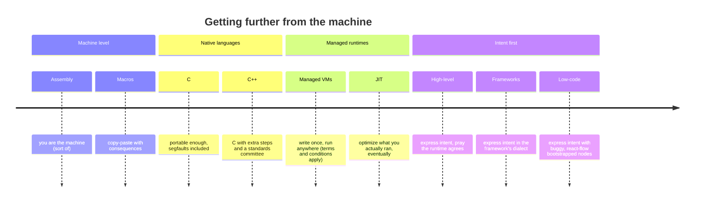

We tell ourselves each generation **stands on the shoulders of giants**. In practice we often stand on **a pile of runtimes** and call it progress.

## A compressed history of "getting further from the machine"

Each step traded **control** for **reach**:

- **Assembly** gave truth and pain.
- **C** gave portability and manual memory.
- **Java / .NET** pushed toward **virtual machines** so hardware details could be ignored—until they could not (GC pauses, container memory, AOT revivals).
- **JIT** promised peak performance without ahead-of-time commitment; you paid in warmup, complexity, and "works on my machine" bytecode.

The **run anywhere** dream was real enough to reshape hiring. It also **abstracted languages into runtimes** until the runtime became the real product (CLR, JVM), and the language became syntax for feeding it.

## Traps of the human mind when designing languages and frameworks

### 1. Survivorship bias

"We survived C++ enterprise projects" becomes "C++ is fine for everything." The failures are in **postmortems**, not conference stages.

### 2. False equivalence of pain

"If Rust is hard, hard must mean good." Sometimes hard means **your tool is fighting your actual workload**.

### 3. Feature creep as compassion

Designers add escape hatches until the language is **three languages in a trench coat**. Compassion for power users becomes **tax for everyone else**.

### 4. Framework as moral framework

"If you are not using X, you are doing it wrong." X changes every eighteen months. Moral certainty does not.

### 5. Reification of the VM

When the VM is the platform, language innovation becomes **workarounds**:

- Generics via erasure or boxing
- Value types as a decade-long project
- Async as state machine rewrite theater

Beskid pushes **assembly output without IL handcuffs** and **compile-time power** because we are tired of negotiating with a runtime that updates slower than the language.

### 6. Abstraction as amnesia

Each layer promises you can forget below. Then production reminds you: **GC**, **thread pools**, **HTTP/2**, and **disk** still exist. You just debug them with worse symbols.

## Giants or ladders?

Shoulders of giants implies **visibility**. Abstraction towers imply **fog**.

Beskid is not anti-abstraction. It is anti-**unpaid** abstraction: layers you did not choose, cannot see in the binary, and cannot remove when the business rule is simple but the stack is not.

Next: [1.7 segfault or not to segfault](/book/00-why-beskid-exists/segfault-or-not-to-segfault/).
