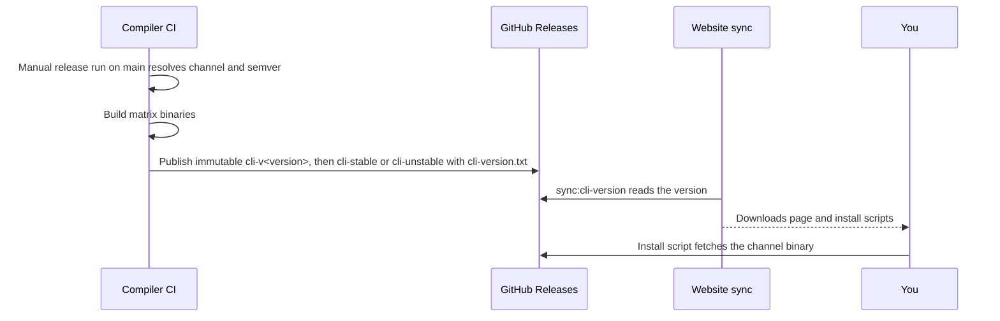

Beskid does not ask you to compile from source on day one unless you want to. The public site publishes **rolling** CLI builds tied to compiler CI, not hand-edited patch bumps in a README.

## Rolling CLI channels

A verified release operator publishes prebuilt binaries to **GitHub Releases** on [beskid_compiler](https://github.com/Cyber-Nomad-Collective/beskid_compiler) (`cli-stable`/`cli-unstable`, `cli-version.txt`, immutable `cli-v*`). Native builds and provenance use the same repository scripts in Woodpecker and manual releases. Install scripts under the website (`site/website/public/`) and the [Downloads](/downloads/) page consume a channel-specific rolling tag.

**Text equivalent:** A manually started release run of Compiler CI resolves the release channel and version, builds the platform binaries, and publishes the release assets to an immutable tag and then the rolling channel tag. The website then reads the release metadata and shows the matching download and install choices, and the install script fetches the binary from the release.

The website can sync displayed version from GitHub via `pnpm sync:cli-version` (see `packages/trudoc/scripts/sync-cli-version.mjs`), which updates `site/website/src/data/cli-version.json` and aligns `compiler/crates/beskid_cli/Cargo.toml` when you develop in the superrepo.

## What you get per platform

Typical release artifacts include the `beskid` CLI for common OS/arch pairs (Linux, macOS, Windows—exact matrix follows CI). Platform packages (`.deb`, `.msi`, `.dmg`, Homebrew) and container images are also available; see [Downloads](/downloads/) for the full list.

User-facing docs may also mention `cdn.beskid-lang.org` for direct binary fetch; treat the Downloads page as the curated entry.

## Pinning vs living on the edge

| Situation | Recommendation |
| --- | --- |
| Local hacking | Rolling `cli-stable`/`cli-unstable` is fine; re-run install when things break mysteriously. |
| CI for your app repo | Pin a known version string from `cli-version.txt` or cache a specific release asset; document the pin in your pipeline. |
| Reproducing a bug report | Record `beskid --version` **and** the git commit of the compiler if built locally. |

## Normative pointers

- [CLI distribution and install](/docs/standard/tooling/cli-and-distribution/) (platform spec tooling area)
- [Downloads page](/downloads/) — install tabs and command blocks

## Next

[Install scripts and PATH](/book/01-it-works-on-my-machine/install-scripts-and-path/)
