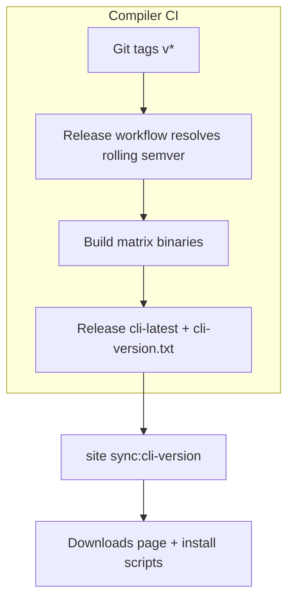

Beskid does not ask you to compile from source on day one unless you want to. The public site publishes **rolling** CLI builds tied to compiler CI, not hand-edited patch bumps in a README.

## Rolling `cli-latest`

The **beskid** superrepo GitHub Actions release workflow publishes prebuilt binaries to **GitHub Releases** on [beskid_compiler](https://github.com/Cyber-Nomad-Collective/beskid_compiler) (`cli-latest`, `cli-version.txt`, immutable `cli-v*`). Version resolution, matrix builds, provenance, and promotion use repository scripts plus reusable GitHub Actions workflows. Install scripts under the website (`site/website/public/`) and the [Downloads](/downloads/) page consume that stream.

The website can sync displayed version from GitHub via `bun run sync:cli-version` (see `packages/trudoc/scripts/sync-cli-version.mjs`), which updates `site/website/src/data/cli-version.json` and aligns `compiler/crates/beskid_cli/Cargo.toml` when you develop in the superrepo.

## What you get per platform

Typical release artifacts include the `beskid` CLI for common OS/arch pairs (Linux, macOS, Windows—exact matrix follows CI). You also get install scripts that place the binary and wire PATH hints; details are on [Downloads](/downloads/).

User-facing docs may also mention `cdn.beskid-lang.org` for direct binary fetch; treat the Downloads page as the curated entry.

## Pinning vs living on the edge

| Situation | Recommendation |
| --- | --- |
| Local hacking | Rolling `cli-latest` is fine; re-run install when things break mysteriously. |
| CI for your app repo | Pin a known version string from `cli-version.txt` or cache a specific release asset; document the pin in your pipeline. |
| Reproducing a bug report | Record `beskid --version` **and** the git commit of the compiler if built locally. |

## Normative pointers

- [CLI distribution and install](/platform-spec/tooling/cli-and-distribution/) (platform spec tooling area)
- [Downloads page](/downloads/) — install tabs and command blocks

## Next

[Install scripts and PATH](/book/01-it-works-on-my-machine/install-scripts-and-path/)
