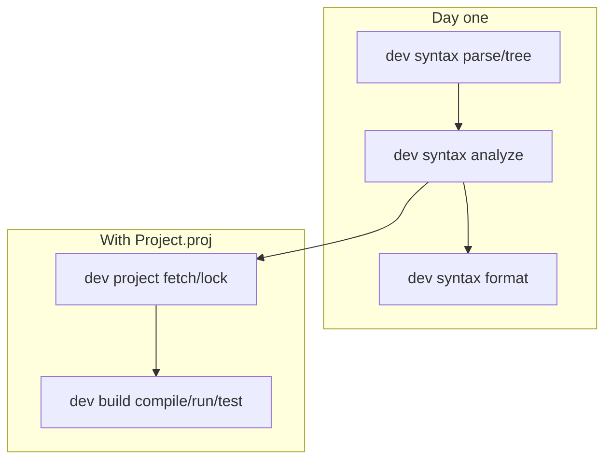

The CLI is the ground truth. Editors are a pretty face on the same pipeline.

## Global behavior

- Response files: `@file` expansion (Rust `argfile` convention).
- Failures: diagnostic report (miette) + non-zero exit unless noted.
- Corelib: materialized on launch; override with `BESKID_CORELIB_SOURCE`.

Full tables: [CLI command reference](/book/reference/cli/command-reference/).

## Commands you will actually press

| Command | Why you care |
| --- | --- |
| `dev syntax parse` / `dev syntax tree` | "Did the parser see my file?" |
| `dev syntax analyze` | Semantic diagnostics before you blame codegen |
| `dev syntax format` | Stop formatting debates |
| `dev project fetch` / `dev project lock` / `dev project update` | Dependencies and reproducibility |
| `dev build compile` / `run` | Ship something executable |
| `dev build test` | Run `test` items in the project |
| `new` | Templates for projects/workspaces/items |
| `dev syntax doc` | `api.json` + markdown API output |
| `dev build corelib` | Materialize embedded corelib template |
| `dev package registry` | Registry client when you publish packages |



## Project-scoped flags

When a manifest exists, prefer explicit roots while learning:

```bash
beskid dev syntax analyze --project ./Project.proj --target App
```

`--frozen` / `--locked` participate in resolution policy—see [fetch](/book/reference/cli/commands/fetch/) and [lock](/book/reference/cli/commands/lock/).

## Next

[Logging and debug flags](/book/02-path-not-found-tooling-anyway/logging-and-debug-flags/)
