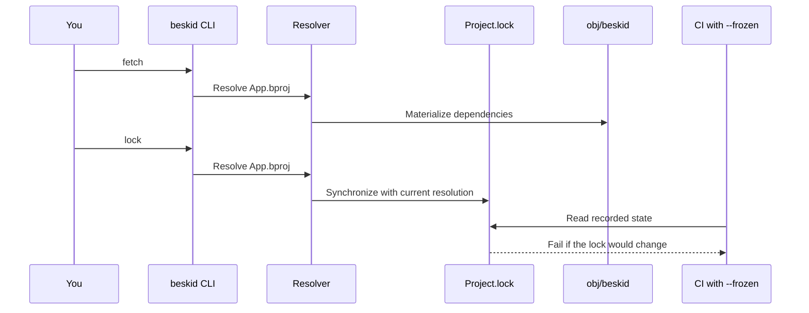

Manifests declare intent. **Locks** declare what actually happened—so CI and your laptop stop arguing.

## The trio

| Command | Role |
| --- | --- |
| `fetch` | Resolve and materialize dependencies into `obj/beskid` |
| `lock` | Synchronize `Project.lock` with current resolution |
| `update` | Refresh resolution and materialized tree when policy allows |

Reference: [fetch](/book/reference/cli/commands/fetch/), [lock](/book/reference/cli/commands/lock/), [update](/book/reference/cli/commands/update/), [lockfile guide](/book/reference/projects/lockfile/).

## Frozen / locked builds

CI should prefer **reproducible** resolution:

- `--frozen` — fail if lock would change
- `--locked` — enforce lock consistency (see per-command docs for exact semantics)

**Text equivalent:** `fetch` resolves `App.bproj` and materializes dependencies under `obj/beskid`. `lock` synchronizes `Project.lock` with the current resolution. CI runs with `--frozen` and fails if the lock would change.

## When the lock changes

Expect `Project.lock` updates when:

- You add/remove/retarget dependencies
- Path dependencies move on disk (sometimes)
- Resolver policy or toolchain version changes resolution

Do **not** `.gitignore` the lock because "it is generated" unless you enjoy production roulette.

## Path-only era (v1)

With `source = path`, drift can mean different local folders. With `source = registry`, inspect the selected active version in `Project.lock`. Workspaces add shared override policy—chapter [06](/book/06-monorepo-as-coping-mechanism/).

## Standard reference (informative)

- [Workspace and lock contracts](/docs/standard/tooling/manifests-and-lockfiles/workspace-and-lock-contracts/)

## Next

[Tree and resolution](/book/03-project-proj-or-it-didnt-happen/tree-and-resolution/)
