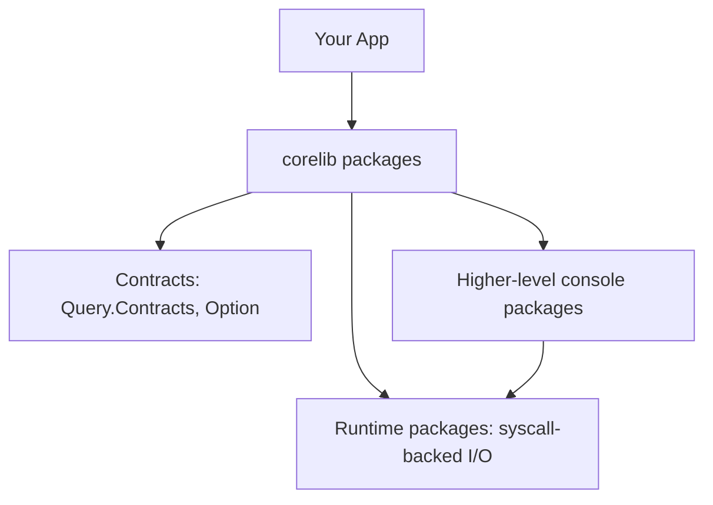

Application code is yours. **Corelib** is the shared floor—collections, contracts, options, the stuff you should not rewrite per repo.

## Identity

Package identity is **`corelib`** (legacy `standard_library` paths may still be accepted by tooling). Sources live in the compiler **`corelib`** submodule / `beskid_corelib/` tree with `beskid_corelib/Project.proj` at the separated workspace root (`BESKID_CORELIB_ROOT`).

Beskid standard library implementation stays **Beskid source**, not a side Rust crate pretending to be std.

## Tooling materialization

CLI ensures bundled corelib is available on launch; override with `BESKID_CORELIB_SOURCE` when hacking std. [`beskid dev build corelib`](/book/reference/cli/commands/corelib/) materializes embedded templates for offline/bootstrap scenarios.

## Layout mental model

Corelib splits into **interlinked workspace packages** (not one monolithic `IO.bd` dumping ground):

- Primitive types and contracts near `Query.Contracts` (including `Option<T>`)
- Runtime syscall-backed I/O under runtime packages; higher console work in dedicated packages (see platform [core library](/platform-spec/core-library/) domain)

**Text equivalent:** Your application depends on corelib packages: contracts such as `Option<T>`, higher-level console packages, and runtime packages with syscall-backed I/O. The console packages build on the runtime packages.

## Docs and `api.json`

Compiler `doc` emission can place `api.json` and markdown under `.beskid/docs/`—registry and pckg treat structured API JSON as the primary contract. You consume std docs like any package docs, not a separate mythological website.

## Standard reference (informative)

- [Core library domain](/platform-spec/core-library/)
- [Types — Option](/platform-spec/language-meta/type-system/types/)

## Next chapter

[05. Names nobody agreed on](/book/05-names-nobody-agreed-on/)
