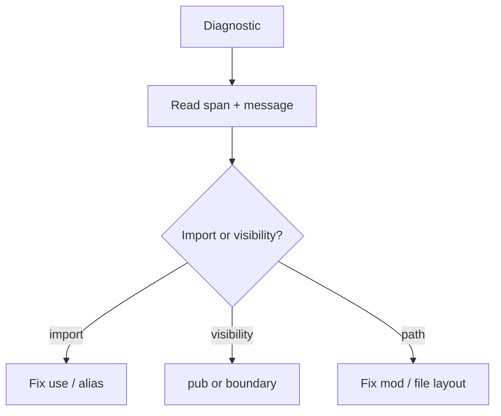

import { Aside } from '@astrojs/starlight/components';

If you only read one page in this chapter, read this. These diagnostics are your daily companions.

## Ambiguous import

**Symptom:** two imports expose the same name.

**Fix:** alias at least one (`use a.Parser as AParser`).

<Aside type="caution">

Do not "fix" ambiguity by deleting random imports until the error disappears—you will just ship the wrong `Parser`.

</Aside>

## Unresolved name

**Symptom:** symbol not found in scope.

Checklist:

1. Typo in identifier
2. Missing `use`
3. Symbol not `pub` in defining module
4. Wrong module path vs file layout

## Cannot access private item

**Symptom:** using something that exists but is not exported.

**Fix:** mark `pub` at the definition (if it should be API) or stop reaching into another module's internals.

## File-scoped module violations

**Symptom:** extra `mod` in a file-scoped module file.

**Fix:** move nested modules to another file or drop file-scoped declaration.

## Reading the report

CLI and LSP share miette-style reports. Read:

- **Span** — which file/line
- **Code** — diagnostic id when present (registry: [diagnostic code registry](/platform-spec/compiler/semantic-pipeline/diagnostic-code-registry/))

## Reference

- [Semantic rules](/book/reference/analysis/semantic-rules/)

## Next chapter

[06. Monorepo as coping mechanism](/book/06-monorepo-as-coping-mechanism/)
