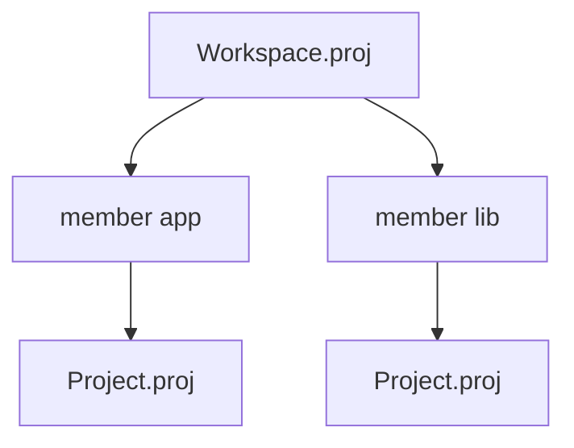

`Workspace.proj` is the umbrella manifest for multi-project repos. It does not replace per-project `Project.proj` files—it coordinates them.

## Building blocks

- **`workspace { ... }`** — workspace identity and resolver policy
- **`member "<label>" { path = "..." }`** — adds a project at `path`
- **`override "<dep>" { version = "..." }`** — shared version policy (forward-looking as registry deps mature)
- **`registry "<name>" { url = "..." }`** — centralized registry endpoints

## Why bother

| Without workspace | With workspace |
| --- | --- |
| Each project owns conflicting dep policy | Shared overrides |
| CI scripts special-case every folder | One lock/resolution story |
| "Which Project.proj?" roulette | Explicit members |

## Minimal mental picture

## Guides and spec

- [Workspace monorepo setup](/book/reference/workspace-monorepo/)
- [Workspace and lock contracts](/platform-spec/tooling/manifests-and-lockfiles/workspace-and-lock-contracts/)

## Next

[Member projects](/book/06-monorepo-as-coping-mechanism/member-projects/)
