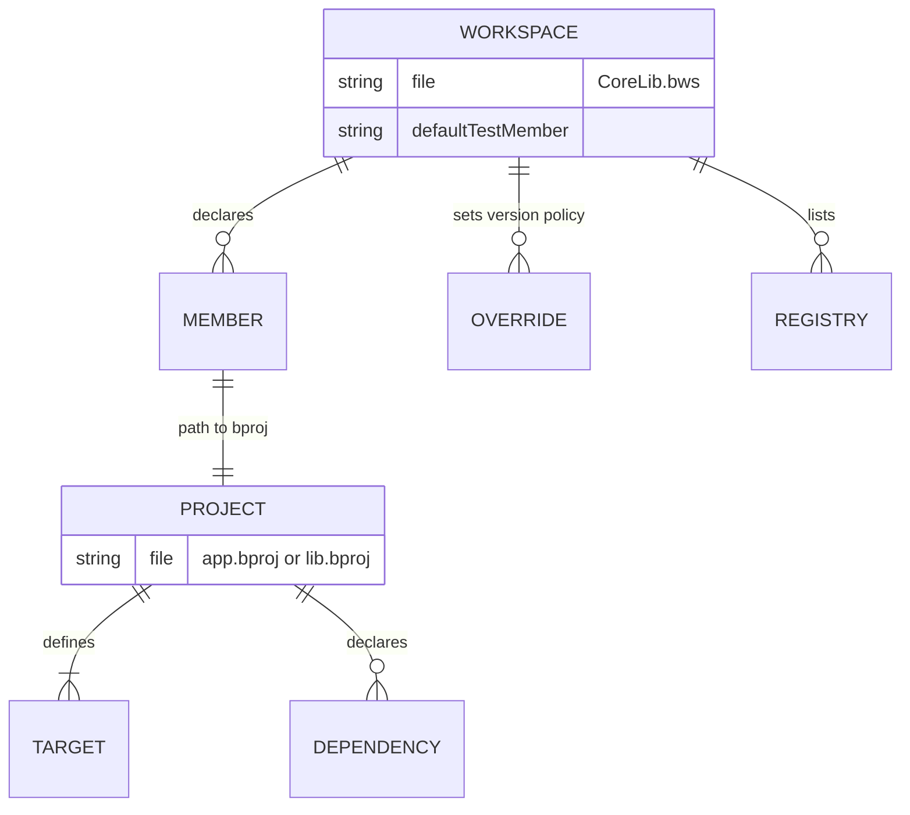

**`.bws`** workspace manifests coordinate multi-project repos. They do not replace per-member **`.bproj`** files—they declare members and shared resolver policy.

Legacy **`Workspace.proj`** is rejected (**E1895**); rename to a `.bws` file (for example `CoreLib.bws`).

## Building blocks

- **`workspace { ... }`** — workspace identity and resolver policy; extras such as **`defaultTestMember`** select the member when you pass the workspace path without `--workspace-member`
- **`member "<label>" { path = "..." }`** — adds a project at `path`; optional extras (`package`, `description`, `category`, `tags`) are publish/editor metadata merged from the workspace manifest
- **`override "<dep>" { version = "..." }`** — shared registry version policy
- **`registry "<name>" { url = "..." }`** — centralized registry endpoints

## Why bother

| Without workspace | With workspace |
| --- | --- |
| Each project owns conflicting dep policy | Shared overrides |
| CI scripts special-case every folder | One lock/resolution story |
| "Which `.bproj`?" roulette | Explicit members |

## Minimal mental picture

**Text equivalent:** A `.bws` workspace declares members, shared overrides and registries. Each member points at its own `.bproj` project, and that project defines targets and dependencies.

## Guides and spec

- [Workspace monorepo setup](/book/reference/workspace-monorepo/)
- [Workspace and lock contracts](/docs/standard/tooling/manifests-and-lockfiles/workspace-and-lock-contracts/)

## Next

[Member projects](/book/06-monorepo-as-coping-mechanism/member-projects/)
