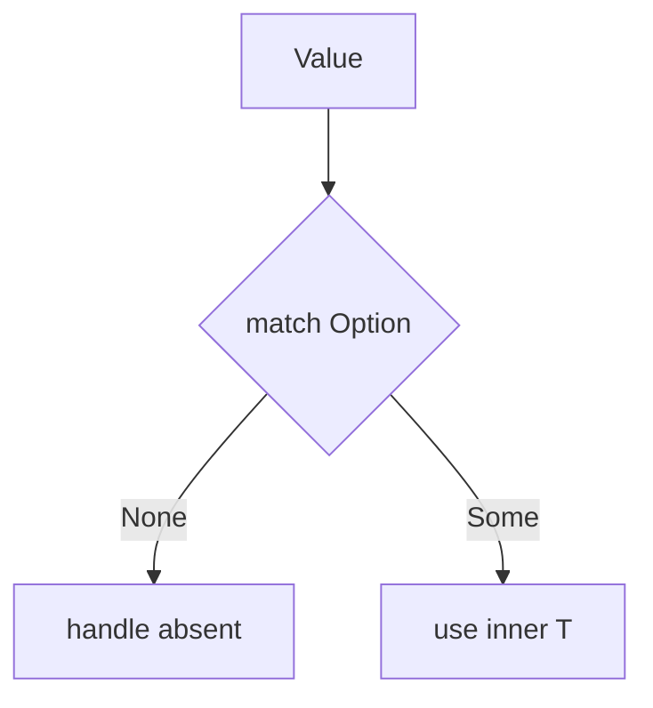

import { Aside } from '@astrojs/starlight/components';

If you type `null` expecting sympathy, you will receive diagnostics instead.

## `Option<T>` only

Optional presence **must** use `Option<T>` (corelib `Query.Contracts.Option`) or an explicit `enum` with a dedicated absent variant at API boundaries.

- **Forbidden:** `null`, `optional` keyword, `?T` sugar
- **Present / absent:** `Option<T>::Some(x)` / `Option<T>::None` (exact constructors per corelib)

<Aside type="danger">

Do not model failure as `Option`—use `Result`-shaped enums for errors ([error handling](/platform-spec/language-meta/contracts-and-effects/error-handling/)).

</Aside>

## Why the industry default is rejected

`null` made billion-dollar bugs feel normal. Beskid chooses explicit enums so absence shows up in `match`, not in a surprise NRE at runtime.

## Handling options

Use `match` on options (see [enums and match](/platform-spec/language-meta/type-system/enums-and-match/)). Calling methods on a maybe-absent value without narrowing is a compile error—not a Friday production mystery.

## Normative decisions

- **D-LM-TYP-002 — `Option<T>` only** in [Types](/platform-spec/language-meta/type-system/types/)
- Glossary: [glossary and conformance](/platform-spec/language-meta/conformance/glossary-and-conformance/)

## Next

[Functions and methods](/book/07-compiler-is-not-your-therapist/functions-and-methods/)
