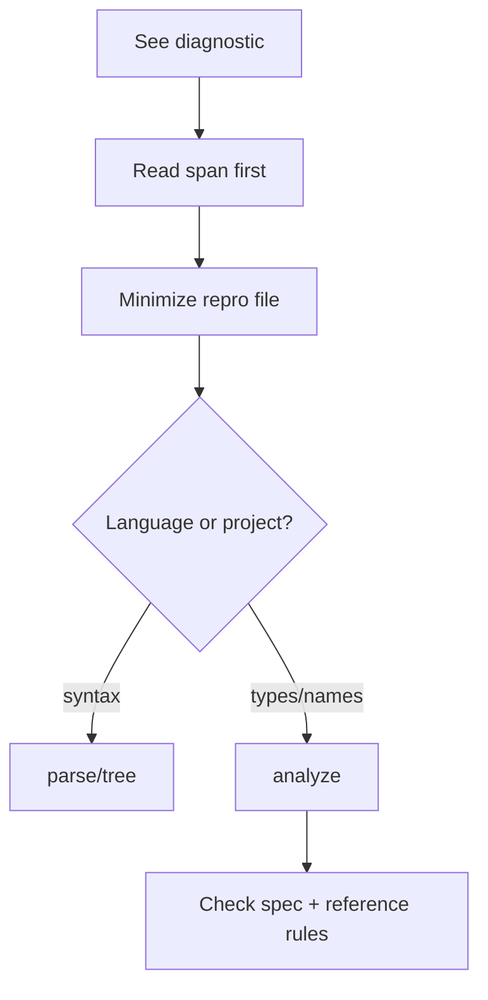

import { Aside } from '@astrojs/starlight/components';

The compiler is not your therapist. It will not validate your architecture feelings. It will point at a **span** and expect action.

## Anatomy of a report

Typical CLI output (miette-style):

1. **Message** — what went wrong in human language
2. **Span** — file + line range
3. **Hint / help** — sometimes suggests a fix
4. **Code** — stable diagnostic id when registered

Registry hub: [diagnostic code registry](/platform-spec/compiler/semantic-pipeline/diagnostic-code-registry/).

## Severity discipline

| Severity | Your job |
| --- | --- |
| Error | Fix before ship |
| Warning | Fix or document why ignored |
| Info | Usually style/education |

<Aside type="tip">

Reproduce in CLI before arguing with LSP squiggles—editor caches lie for sport.

</Aside>

## Workflow

## When the message feels wrong

Sometimes the message is accurate but the **root cause** is two modules away (bad `pub use`, wrong `Project.proj` root). Follow imports and manifest roots before opening compiler issues.

## Related tutorial pages

- [Diagnostics you will see](/book/05-names-nobody-agreed-on/diagnostics-you-will-see/)
- [Semantic rules](/book/reference/analysis/semantic-rules/)

## Where to go next

Public API idioms and documentation comments live in later book entries and [platform spec](/platform-spec/language-meta/). You now have enough vocabulary to read real Beskid code without treating the analyzer as malice.
