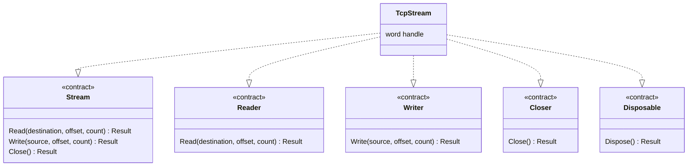

A Beskid **`contract`** is a **structural interface**: required members, optional embeddings, checked at compile time when a type lists conformances.

## Declaration

```beskid
contract Disposable
{
    unit Dispose();
}

type Logger : Disposable
{
    unit Dispose() { /* ... */ }
}
```

Normative detail: [Contracts](/platform-spec/language-meta/contracts-and-effects/contracts/).

## Conformance lists

Types declare **`type Name : I, J { ... }`**. The compiler checks every required member (**E1601–E1607**). Conflicting embeddings from two contracts **must** error—no C#-style diamond denial as a lifestyle.

## Embeddings

```beskid
contract Readable
{
    i32 Read(ref u8 buffer);
}

contract ReadWrite : Readable
{
    i32 Write(ref u8 buffer);
}
```

Embedding flattens requirements; implementers satisfy the expanded surface once.

The corelib byte-stream contracts show the pattern. `Stream` lists the read, write and close members, and `TcpStream` in the network package conforms to it together with the single-purpose contracts.



**Text equivalent:** `Reader`, `Writer`, `Closer` and `Disposable` are one-operation contracts. `Stream` declares read, write and close. `TcpStream` lists `Stream`, `Reader`, `Writer`, `Closer` and `Disposable` in its conformance list.

## Not Mod SDK contracts

| Surface | Purpose |
| --- | --- |
| `contract Foo { ... }` in user code | Type conformance, static dispatch |
| `Beskid.Compiler.*` mod contracts | Compile-time plugins ([Compiler Mod SDK](/platform-spec/language-meta/metaprogramming/compiler-mod-sdk/)) |

## Contracts vs classes

Contracts describe **capabilities**, not inheritance trees. Prefer small contracts composed with embeddings over one "god interface" copied from enterprise slides.

## Next

[Effects and purity](/book/09-contracts-effects-and-polite-threats/effects-and-purity/)
