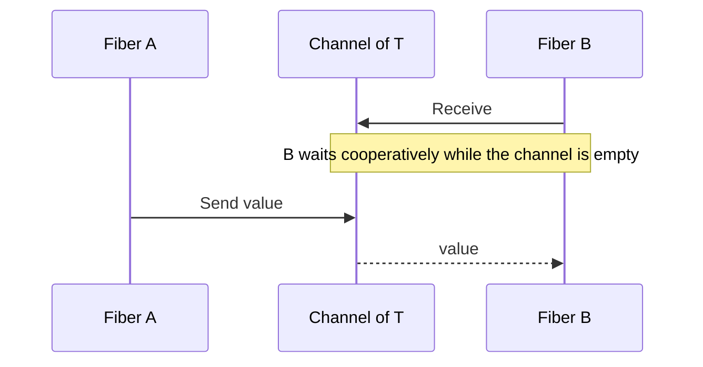

If two fibers need to talk, they use a **channel**. They do not share a mutable stack and hope for the best—that pattern already has a body count in other languages.

## Model

- **`Channel<T>`** carries typed messages between fibers.
- **Send** / **Receive** operations block cooperatively (scheduler-aware).
- Errors and cancellation surface through **`Result`** on join/receive paths per [Concurrency package](/platform-spec/core-library/concurrency/concurrency-package/).

**Text equivalent:** Fiber B calls Receive and waits cooperatively. When Fiber A sends a value, the channel hands it to Fiber B.

## ADR-backed choices

Cross-fiber events use channels, not ad-hoc flags—see [ADR: cross-fiber events use channels](/platform-spec/language-meta/evaluation/fibers-and-spawn/adr/0004-cross-fiber-events-use-channels/).

## Mutex and WaitGroup

**Mutex** and **WaitGroup** coordinate invariants—they are **not** a substitute for channel payload transfer. If you are passing data, use a channel; if you are guarding a critical section, use the primitives the spec names.

## Memory interaction

Shared **heap** objects still follow [Memory and references](/platform-spec/language-meta/memory-model/memory-and-references/)—channels are how you avoid data races without pretending Beskid is C++.

## Next

[Corelib concurrency](/book/11-fibers-cheaper-than-threads/corelib-concurrency/)
