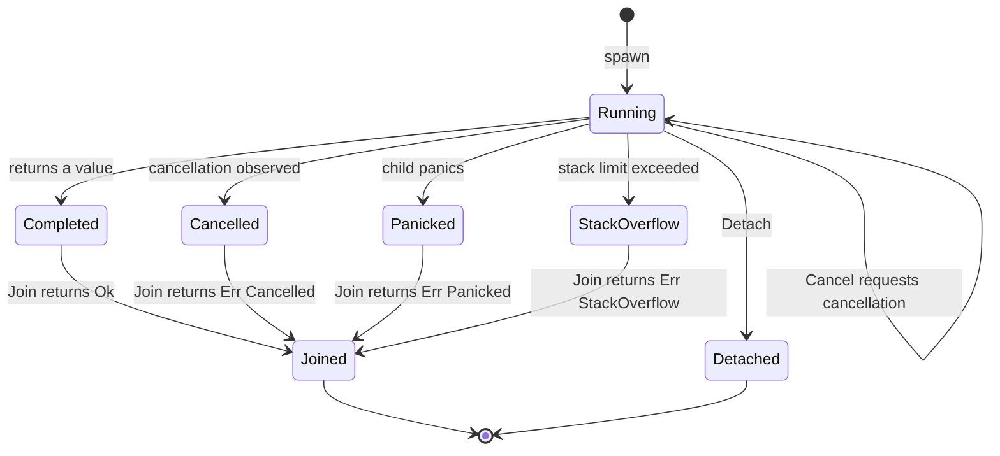

```beskid
Fiber<i32> worker = spawn DoWork(42);
```

`spawn` is not "fire a thread." It schedules a **cooperative fiber** with a typed handle.

## Types

Every `spawn` expression **must** type-check to **`Fiber<T>`** where `T` is the entry callable's return type (`Concurrency.Fiber` in `corelib_concurrency`). You do not get `T` directly from `spawn`—use **`Join`**.

Normative feature: [Fibers and spawn](/platform-spec/language-meta/evaluation/fibers-and-spawn/).

## Handle and cancellation

The handle exposes **`OnCancelled`** as an event on the **child fiber handle**, not on the entry callable. Cancellation flows: **Cancel** → observe **OnCancelled** → **Join** / channel errors per the [decisions record](/platform-spec/core-library/concurrency/concurrency-package/decisions-record/).

The handle is move-only. `Join` and `Detach` consume it, while `Cancel` only requests cancellation and leaves the handle usable.



**Text equivalent:** `spawn` starts a running fiber. `Cancel` may be called repeatedly while it runs. The fiber ends as completed, cancelled, panicked or stack overflow, and `Join` consumes the handle with the matching `Result`. `Detach` consumes the handle without joining and waives the shutdown join.

## Semantic rules (cheat sheet)

| Rule | Consequence |
| --- | --- |
| Stack references must not escape `spawn` | `StackReferenceEscapesSpawn` diagnostic |
| **Detach** waives shutdown join | Otherwise runtime joins non-detached children when `main` returns |
| Cross-fiber payload | **Channels only** — not mutex-as-mailbox |

## Lowering

`beskid_codegen` emits `fiber_spawn` with environment captures rooted for GC. Runtime details: [Fiber scheduler and stacks](/platform-spec/execution/runtime/fiber-scheduler-and-stacks/).

## Next

[Channels preview](/book/11-fibers-cheaper-than-threads/channels-preview/)
