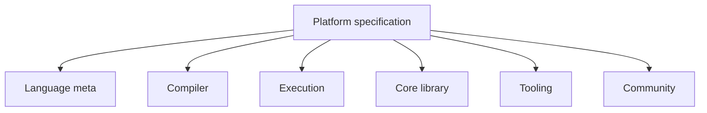

Open [/platform-spec/](/platform-spec/). That is the normative front door—no version prefix in the URL, Git as the axis ([Release policy](/platform-spec/community/spec-maintenance/release-and-versioning-policy/)).

## Top-level shape

## Reader chrome

Platform-spec pages use dedicated reader UI (tabs, ADRs, architecture graphs)—not the book's chapter rail. Expect:

- **Current document** / **Articles** / **ADRs** / **Architecture** tabs on feature hubs
- `status: Standard` vs `Proposed` in headers
- `lastReviewed` for freshness

## Book vs spec

| Need | Go to |
| --- | --- |
| Tutorial voice, workflows | `/book/` |
| Enforceable contracts | `/platform-spec/` |
| CLI flag lists | `/book/reference/cli/` |

## Next

[Language meta map](/book/13-reading-the-law/language-meta-map/)
