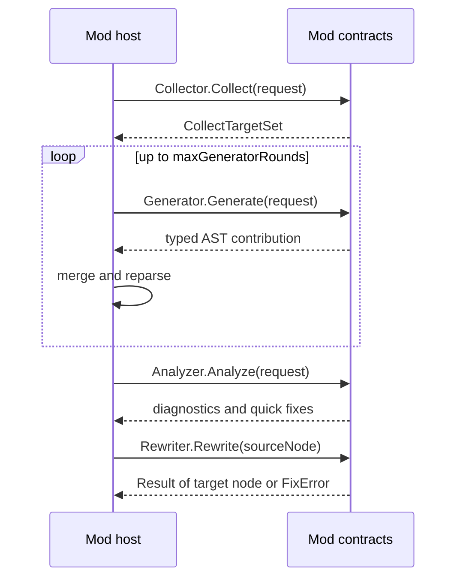

Three roles, one merged program. Order matters; host merge is **bounded** and **fail-closed**.

## Generator

- Emits **typed AST** fragments only.
- Host merges, **re-parses**, repeats up to `maxGeneratorRounds`.
- Incremental by default—don't regenerate the universe per keystroke.

Spec: [Typed emitter and transforms](/docs/standard/compiler/compiler-mods/typed-emitter-and-transforms/).

## Analyzer

- Runs on **host + generated** code after semantic snapshot exists.
- Emits diagnostics; may register **rewrites as fixes**.
- Must not assume generated code is "second class"—it's all one program now.

Spec: [Analysis, query, and diagnostics facades](/docs/standard/compiler/compiler-mods/analysis-query-diagnostics-facade/).

## Rewriter

```beskid
// Conceptual shape — see SDK for exact signatures
Result<TTargetNode, FixError> Rewrite(TSourceNode sourceNode);
```

Replaces any valid node with any other valid typed node—power with responsibility. Conflicts → diagnostics, not silent corruption.



**Text equivalent:** The host collects targets, then repeats generate, merge and reparse up to `maxGeneratorRounds`. It then runs the analyzer for diagnostics and fixes and applies the rewriter, which returns a `Result` with the target node or a `FixError`.

## Conflict policy

Scheduling and determinism: [Incremental scheduling and determinism](/docs/standard/compiler/compiler-mods/incremental-scheduling-determinism/). When two mods fight over the same node, the host picks a documented winner or fails—read the ADRs before betting production on undocumented merge luck.

## Next

[beskid mod CLI](/book/15-mods-plugins-with-consequences/beskid-mod-cli/)
